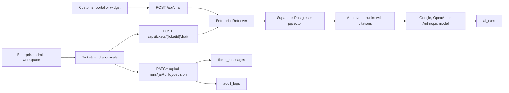

# Architecture

SupportPilot has two operating modes:

- Lite mode: file-based retrieval from `/knowledge`, deterministic fallback answers when no model key exists, and the embeddable chat/widget flow.
- Enterprise mode: Supabase Auth, Postgres, pgvector retrieval, role-backed workspace routes, AI draft replies, human approval, audit logs, and analytics.

## Data Layer

`supabase/migrations/001_enterprise_supportpilot.sql` defines the enterprise schema:

- Identity and tenancy: `users`, `customers`
- Support operations: `tickets`, `ticket_messages`
- Knowledge and RAG: `knowledge_docs`, `document_chunks`, `match_document_chunks`
- AI governance: `ai_runs`, `ai_feedback`, `audit_logs`, `escalation_rules`

`lib/db/support.ts` is the application data boundary. It uses Supabase admin access when `NEXT_PUBLIC_SUPABASE_URL`, `NEXT_PUBLIC_SUPABASE_ANON_KEY`, and `SUPABASE_SERVICE_ROLE_KEY` are present. Without those env vars, it uses deterministic seeded data for portfolio review.

## RAG

Uploaded `.md`, `.txt`, and `.pdf` files are normalized to text in `POST /api/knowledge/upload`, chunked by `lib/rag/chunking.ts`, embedded with `lib/rag/embeddings.ts`, and stored as approved chunks. Retrieval calls `match_document_chunks` first, then falls back to lexical scoring over approved Supabase chunks if vector results are empty.

## AI Workflow

`lib/workflows/draft.ts` builds a ticket-specific prompt from customer metadata, conversation history, and approved source chunks. Drafts are saved to `ai_runs` with citations, confidence, rationale, risk flags, and approval status.

`lib/workflows/risk.ts` escalates low-confidence, angry, legal/policy, billing/refund, and sensitive-data cases. AI never writes a final customer reply directly. Approval or edit decisions create the customer-facing `ticket_messages` row and always write `audit_logs`.

## Auth and Roles

`proxy.ts` protects `/admin` when Supabase env vars exist. Staff roles are `support_agent`, `support_manager`, and `admin`; customers are routed to `/portal`. Local demo mode remains open so the portfolio can run without credentials.

## Observability

`ai_runs` and `audit_logs` are the product source of truth. Sentry is optional and activated by `SENTRY_DSN` for application errors and request instrumentation.
