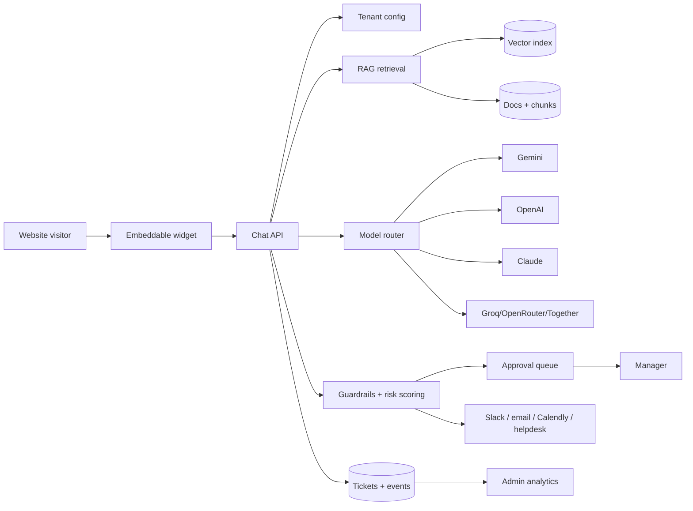
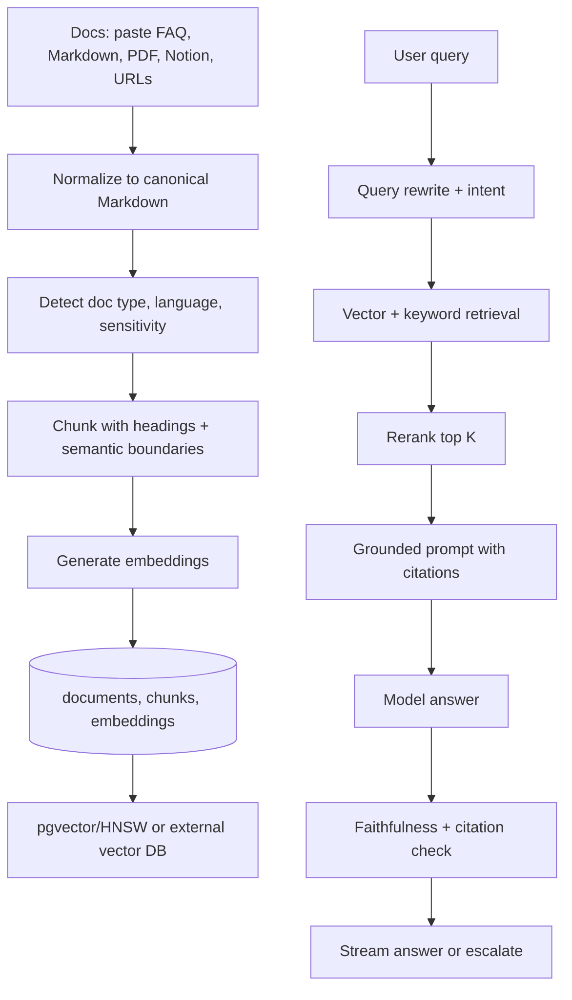
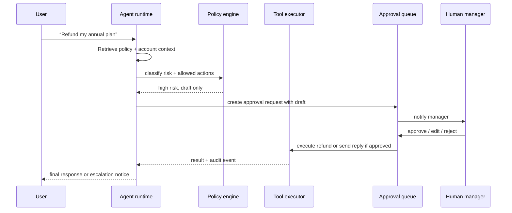
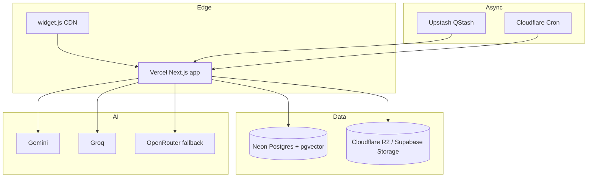
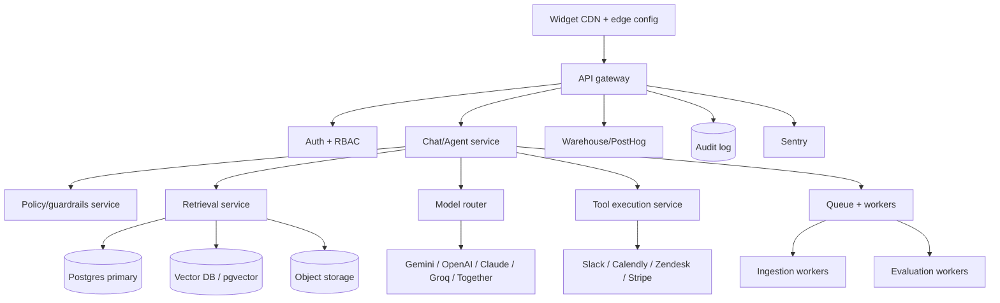

# SupportPilot Enterprise Architecture

## Architecture goals

SupportPilot’s enterprise architecture should deliver multi-tenant isolation, grounded generation, source citations, human-in-the-loop approvals, safe tool execution, observability, and low-cost operation. The current demo already points in this direction with Supabase auth, Postgres, pgvector, storage-ready knowledge uploads, RLS, Sentry, and routes for tickets, approvals, knowledge, and analytics ([GitHub repository page](https://github.com/anilandcode/supportpilot-demo)).

The Advanced architecture should be modular enough to run cheaply on Vercel/Neon/Supabase at first and to move hot paths to Cloudflare Workers, AWS Lambda, ECS/Fly/Railway, or dedicated queues when volume grows.

## System context



## Recommended services by domain

| Domain | Core service | Responsibility |
|---|---|---|
| Tenant management | `orgs`, `workspaces`, `domains`, `widget_configs` | White-label identity, allowed domains, theme, bot persona, plan limits. |
| Knowledge | `sources`, `documents`, `chunks`, `embeddings`, object storage | Ingestion, versioning, source provenance, chunk text, vector embeddings. |
| Conversations | `conversations`, `messages`, `citations`, `retrieval_events` | Chat history, answer trace, source citations, retrieval diagnostics. |
| Ticketing | `tickets`, `ticket_events`, `assignments`, `priorities` | Human-support workflow and status transitions. |
| AI runs | `ai_runs`, `model_calls`, `tool_calls`, `risk_assessments` | Prompt/model metadata, cost, latency, confidence, risk category. |
| Approvals | `approval_requests`, `approval_decisions`, `approval_policies` | Manager review for low-confidence/high-risk drafts. |
| Integrations | `integration_accounts`, `webhooks`, `outbound_events` | Slack, Calendly, Zendesk, Gorgias, Intercom, email, CRM. |
| Audit | `audit_logs`, `security_events`, `data_exports` | SOC 2 evidence, admin actions, policy changes, access events. |
| Billing | `plans`, `usage_events`, `stripe_customers`, `entitlements` | Usage metering, quotas, upgrade triggers, outcome telemetry. |

## Multi-tenant data model

Every tenant-owned row should carry `tenant_id`, and every admin-scoped row should carry both `tenant_id` and `workspace_id` when relevant. Supabase’s RLS documentation explains that `auth.uid()` returns the authenticated user ID and warns that unauthenticated requests return `null`, which makes explicit authenticated-role policies important ([Supabase RLS docs](https://supabase.com/docs/guides/database/postgres/row-level-security)).

Recommended isolation layers:

1. **Database RLS**: enforce `tenant_id in current_user_memberships()` for all tenant tables.
2. **Application scope**: include `tenant_id` in every server-side query and add typed repository helpers.
3. **Storage prefixing**: store files under `tenant/{tenant_id}/source/{source_id}/...`.
4. **API keys**: issue workspace-scoped publishable widget keys and secret server API keys.
5. **Domain allowlists**: validate widget origin against tenant-owned domains.
6. **Audit logs**: write append-only audit rows for config, source, approval, integration, and permission changes.

## RAG pipeline

Supabase positions Postgres plus pgvector as an AI application stack for storing, indexing, and querying vector embeddings at scale ([Supabase AI & Vectors docs](https://supabase.com/docs/guides/ai)).



### Ingestion rules

| Step | Light | Advanced |
|---|---|---|
| Normalize | Markdown/text only | Markdown, PDF, DOCX, Notion, web pages, help-center imports |
| Chunk | Heading-aware fixed tokens | Semantic chunking, parent/child chunks, table preservation |
| Embeddings | Gemini embedding or OpenAI-compatible single provider | Per-tenant embedding model, migration strategy, embedding versioning |
| Retrieval | pgvector top K | Hybrid search + reranking + tenant/domain filters |
| Citations | Chunk-level links | Span-level citations, source version IDs, answer trace |
| Re-ingestion | Manual upload | Queue-based incremental sync, webhooks, scheduled refresh |

## Grounded-answer contract

Every answer should return a structured envelope:

```ts
type SupportPilotAnswer = {
  answer: string;
  citations: Array<{
    sourceId: string;
    documentId: string;
    chunkId: string;
    title: string;
    url?: string;
    quote: string;
    confidence: number;
  }>;
  confidence: number;
  risk: 'low' | 'medium' | 'high' | 'critical';
  riskCategory?: 'refund_policy' | 'sso_security' | 'billing_dispute' | 'data_residency_legal' | 'medical' | 'other';
  actionRequired?: 'send' | 'draft_for_approval' | 'escalate' | 'refuse';
};
```

The answer contract should fail closed: if there are no high-confidence citations for a factual support answer, the system should either ask a clarifying question or escalate.

## Agentic layer

OpenAI’s tool-calling flow has the model request a tool call, the application executes code with the tool arguments, and the model receives the tool output before producing a final response ([OpenAI function-calling docs](https://platform.openai.com/docs/guides/function-calling)).

Gemini function calling explicitly supports action use cases such as scheduling appointments, creating invoices, and sending emails through external APIs ([Google Gemini function-calling docs](https://ai.google.dev/gemini-api/docs/function-calling)).

SupportPilot should implement tool calls as application-owned workflows, not as direct model authority.



### Tool policy matrix

| Tool category | Examples | Default policy |
|---|---|---|
| Read-only | order lookup, subscription status, ticket history | Allow with tenant-scoped credentials and audit event. |
| Low-impact write | tag ticket, create draft, schedule Calendly link | Allow after validation; log tool call and model reasoning summary. |
| Customer-visible reply | send email/chat response | Allow for low-risk/high-confidence; approval for medium/high risk. |
| Financial | refund, credit, coupon | Require approval unless tenant explicitly sets safe thresholds. |
| Security | SSO config, password reset, access change | Require human approval and step-up authentication. |
| Legal/privacy | data residency, deletion, DPA, subpoena | Escalate or draft for legal-approved human review. |

## Confidence and risk scoring

SupportPilot should calculate confidence from retrieval quality, citation coverage, model self-check, policy category, historical acceptance, and customer sentiment.

```ts
type ConfidenceFeatures = {
  topSimilarity: number;
  rerankerScore: number;
  citationCount: number;
  sourceFreshnessDays: number;
  hasPolicySource: boolean;
  intentRisk: number;
  modelAgreement: number;
  priorTenantAcceptanceRate: number;
};
```

Risk scoring should treat the categories visible in the demo—refund policy, SSO/security config, billing dispute, and data residency/legal—as first-class policy types.

## Model routing

| Route | Default model | Fallback | Notes |
|---|---|---|---|
| Simple FAQ | Gemini Flash / Gemini free tier | Groq small open model | Optimize cost and latency. |
| Complex policy | Gemini Pro / Claude / GPT class | OpenRouter fallback | Require citations and optional self-check. |
| Draft approval | High-quality model | Cheaper model for rewrite | Prioritize tone and completeness. |
| Classification | Small/fast model | Rules | Intent, risk, priority, escalation. |
| Embeddings | Gemini embedding or OpenAI embeddings | pgvector migration versioning | Store `embedding_model` and `embedding_version`. |
| Reranking | Cohere/Jina/Together or lightweight cross-encoder | vector score only | Add when answer quality becomes bottleneck. |

OpenRouter can provide one OpenAI-compatible API with provider fallback and passes through underlying model pricing while charging a credit-purchase fee, which makes it useful as a resilience layer rather than the default cheapest path ([OpenRouter FAQ](https://openrouter.ai/docs/faq)).

Groq publishes model-level rate limits and low per-token pricing for hosted open models, making it useful for fast classification or fallback workloads when free limits allow ([Groq rate-limits docs](https://console.groq.com/docs/rate-limits)).

Together documents serverless inference as pay-per-token with no provisioning cost and no minimum, which makes it a flexible overflow provider for bursty production traffic ([Together AI docs](https://docs.together.ai/docs/serverless/models)).

## Widget and embed architecture

The widget should use one async script plus iframe fallback:

```html
<script async src="https://cdn.supportpilot.ai/widget.js" data-workspace="wk_123" data-theme="auto"></script>
<iframe src="https://app.supportpilot.ai/embed/wk_123" title="Support chat"></iframe>
```

Recommended widget design:

- `widget.js` is tiny, cached, and only bootstraps configuration.
- The full chat UI runs in an iframe to isolate CSS, cookies, CSP, and framework conflicts.
- `postMessage` handles open/close, unread count, height changes, and theme updates.
- The API validates `Origin`, workspace key, domain allowlist, and rate limits.
- Anonymous user identity is a signed, tenant-scoped visitor ID.
- Authenticated SaaS embeds can pass a signed JWT for `external_user_id`, plan, and account metadata.

## Integrations

Slack Incoming Webhooks let apps post messages into Slack channels, which is enough for escalation notifications in the Light and Pro tiers ([Slack Incoming Webhooks docs](https://api.slack.com/messaging/webhooks)).

Calendly’s developer platform exposes APIs and webhooks for scheduling workflows, which fits escalation paths such as “book a support call” ([Calendly developer docs](https://developer.calendly.com/api-docs)).

Zendesk’s ticket API exposes ticket records and updates, which makes Zendesk a natural escalation target for customers already using an incumbent helpdesk ([Zendesk Tickets API](https://developer.zendesk.com/api-reference/ticketing/tickets/tickets/)).

## Observability and analytics

| Layer | Events to capture | Dashboard use |
|---|---|---|
| Chat | message sent, answer streamed, latency, abandonment | Total conversations, response latency, top intents. |
| Retrieval | query, top chunks, scores, rerank results | Source quality, missing docs, hallucination debugging. |
| Model | provider, model, tokens, cost, finish reason, errors | Cost control, routing optimization, fallback alerts. |
| Policy | risk category, confidence, approval rule fired | Approval workload, risky topics, false positives. |
| Human loop | draft approved/edited/rejected, time to approval | AI acceptance %, manager throughput, training data. |
| Escalation | channel, reason, SLA, resolution outcome | Deflection, handoff quality, unresolved topics. |

PostHog’s free tier includes product analytics, session replay, feature flags, error tracking, surveys, data warehouse rows, AI observability events, workflows, and logs with usage-based pricing beyond free quotas ([PostHog pricing](https://posthog.com/pricing)).

Sentry’s free developer plan includes error monitoring with 5,000 errors, alerts, unlimited users, and custom dashboards, making it appropriate for the early production phase ([Sentry pricing](https://sentry.io/pricing/)).

## Security and SOC 2 readiness

OWASP’s LLM Top 10 project is the right baseline for LLM-specific risks such as prompt injection, insecure output handling, sensitive information disclosure, and excessive agency ([OWASP LLM Top 10](https://owasp.org/www-project-top-10-for-large-language-model-applications/)).

NIST’s AI Risk Management Framework is the right governance reference for mapping, measuring, managing, and governing AI risks across the product lifecycle ([NIST AI RMF](https://www.nist.gov/itl/ai-risk-management-framework)).

### Security checklist

- Enforce RLS and typed tenant filters on every query.
- Separate publishable widget keys from secret integration credentials.
- Encrypt integration tokens and rotate on suspicion.
- Log every admin action and every tool action.
- Redact PII before model calls where feasible.
- Add retention controls per tenant and data category.
- Require approval for refunds, billing disputes, security config, and data-residency/legal topics.
- Maintain eval datasets for hallucination, citation grounding, prompt injection, and escalation behavior.
- Add rate limits per workspace, IP, and visitor.
- Maintain DPA, subprocessors list, incident process, and access review evidence for SOC 2 readiness.

## Minimal production topology



## Advanced production topology


