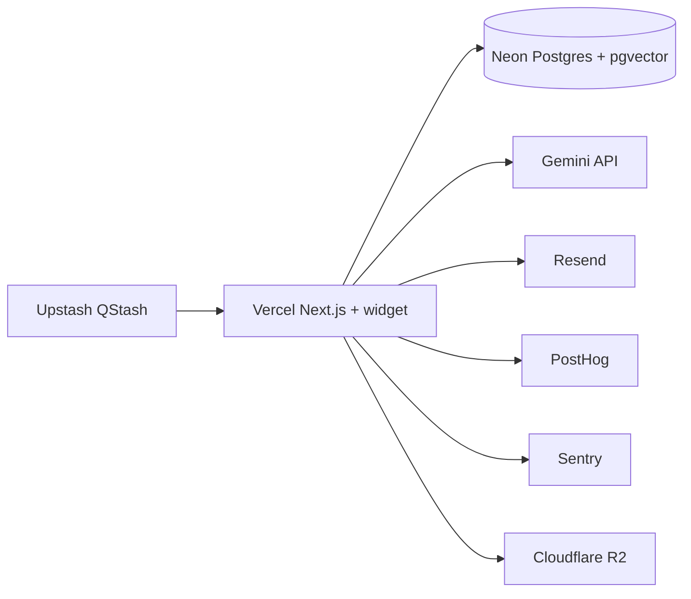
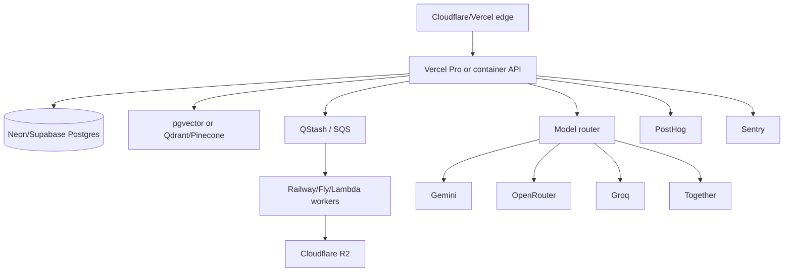

# SupportPilot Zero/Low-Cost Tech Stack

## Stack strategy

The goal is not “free forever”; it is to stay free or near-free through validation while avoiding architectural dead ends. The best low-cost path is a Next.js monorepo on Vercel, Postgres with pgvector on Neon or Supabase, Gemini as the default low-cost model, Resend for email, PostHog for analytics, Sentry for errors, and Cloudflare R2 or Supabase Storage for uploads.

The architecture should keep every vendor replaceable: the data model should not assume a single LLM provider, the RAG index should store embedding model/version, and the widget should work even if the admin app moves from Vercel to another runtime.

## Recommended free-tier stack by layer

| Layer | Default Light choice | Advanced / scaling choice | Stays free until | Upgrade trigger | Paid cost signal |
|---|---|---|---|---|---|
| Web app + admin | Vercel Hobby | Vercel Pro or Cloudflare Pages + API split | Vercel limits include 1M function invocations, 100 GB fast data transfer, and project/account limits on the free side ([Vercel limits](https://vercel.com/docs/limits)) | High API volume, team collaboration, commercial limits, build minutes, or observability needs | Vercel bills function invocations at $0.60 per 1M on paid usage tables ([Vercel limits](https://vercel.com/docs/limits)) |
| Widget CDN | Vercel static assets | Cloudflare CDN/R2-backed widget bundle | Static delivery remains cheap while widget bundle is small | Multi-region custom CDN, strict cache controls, enterprise WAF | Cloudflare R2 egress is free and standard storage is $0.015/GB-month after free storage ([Cloudflare R2 pricing](https://developers.cloudflare.com/r2/pricing/)) |
| API runtime | Vercel Functions | AWS Lambda or Cloudflare Workers | AWS Lambda includes 1M free requests/month and 400,000 GB-seconds/month ([AWS Lambda pricing](https://aws.amazon.com/lambda/pricing/)) | Long-running ingestion, bursty workloads, vendor-specific limits | Lambda requests cost $0.20 per 1M after free tier ([AWS Lambda pricing](https://aws.amazon.com/lambda/pricing/)) |
| Edge/API alternative | Cloudflare Workers | Workers Standard | Workers Free includes 100,000 requests/day and 10 ms CPU time per invocation ([Cloudflare Workers pricing](https://developers.cloudflare.com/workers/platform/pricing/), [Cloudflare Workers limits](https://developers.cloudflare.com/workers/platform/limits/)) | CPU-heavy RAG, >100k/day requests, 50 subrequests/request limit | Workers Standard includes 10M requests/month and charges $0.30 per additional 1M requests ([Cloudflare Workers pricing](https://developers.cloudflare.com/workers/platform/pricing/)) |
| Backend container | Railway trial for prototypes | Railway Hobby/Pro, Render, Fly.io | Railway gives a 30-day trial with a one-time $5 credit and then a Free plan with $1/month credit ([Railway free trial docs](https://docs.railway.com/pricing/free-trial), [Railway pricing](https://railway.com/pricing)) | Persistent workers, custom binaries, headless browsers, ingestion jobs | Railway usage examples show compute rates per GB-second and vCPU-second plus volume/storage rates ([Railway pricing](https://railway.com/pricing)) |
| Free web-service fallback | Render free web service | Render paid instance | Render free web services spin down after 15 minutes of no inbound traffic and are not recommended for production ([Render free docs](https://render.com/docs/free)) | Need always-on production API | Upgrade to paid Render instance when cold starts or ephemeral FS become unacceptable ([Render free docs](https://render.com/docs/free)) |
| Global app hosting alternative | Fly.io | Fly.io paid machines | Fly.io states there is no free account/free tier for new customers and that current customers are usage-billed ([Fly.io cost-management docs](https://fly.io/docs/about/cost-management/)) | Need regional VMs, WebSockets, persistent machines | Fly.io shared CPU 512 MB is listed around $3.32/month on resource pricing ([Fly.io resource pricing](https://fly.io/docs/about/pricing/)) |
| Postgres | Neon Free | Neon Launch/Scale | Neon Free includes 100 projects, 100 CU-hours/project/month, 0.5 GB storage/project, and 5 GB public egress/project/month ([Neon free-plan FAQ](https://neon.com/faqs/free-plan-limits-and-quotas)) | Storage >0.5 GB, CU-hours exhausted, egress exhausted, production SLO | Neon paid storage is $0.35/GB-month and compute starts at $0.106/CU-hour on Launch ([Neon pricing](https://neon.com/pricing)) |
| Postgres + auth + storage | Supabase Free | Supabase Pro | Supabase Free includes unlimited API requests, 50,000 MAUs, 5 GB egress, 1 GB file storage, and 2 active projects ([Supabase pricing](https://supabase.com/pricing)) | Need no project pause, more storage/egress, backups, or support | Supabase Pro is $25/month with usage overages such as disk and egress ([Supabase pricing](https://supabase.com/pricing)) |
| Vector store | pgvector on Neon/Supabase | Qdrant/Pinecone/Upstash Vector | Supabase documents Postgres + pgvector for vector search, and Neon includes pgvector as a Postgres extension ([Supabase AI & Vectors docs](https://supabase.com/docs/guides/ai), [Neon pricing](https://neon.com/pricing)) | Vector recall/latency issues, >hundreds of thousands of chunks, need filters/reranking | External vector DB when query latency or ops maturity justifies it |
| Managed vector DB | Qdrant Cloud Free | Qdrant Standard | Qdrant Free includes 0.5 vCPU, 1 GB RAM, and 4 GB disk ([Qdrant pricing](https://qdrant.tech/pricing/)) | Need HA, larger disk/RAM, dedicated cluster | Qdrant bills standard clusters by compute, memory, storage, backups, and inference tokens ([Qdrant pricing](https://qdrant.tech/pricing/)) |
| Managed vector DB alternative | Pinecone Starter | Pinecone Builder/Standard | Pinecone Starter is free and lists included storage and assistant/token allowances ([Pinecone pricing](https://www.pinecone.io/pricing/)) | Need cloud/region choice, multiple users/projects, monitoring, SLA | Pinecone Builder is $20/month and Standard has $50/month minimum usage ([Pinecone pricing](https://www.pinecone.io/pricing/)) |
| Serverless vector DB | Upstash Vector Free | Upstash usage/fixed | Upstash Vector Free provides 1 free DB and a 10k daily query/update limit ([Upstash Vector pricing](https://upstash.com/pricing/vector)) | >10k vector operations/day or >1 GB data/metadata size | Usage plan is $0.40 per 100k requests ([Upstash Vector pricing](https://upstash.com/pricing/vector)) |
| LLM default | Gemini API Free | Gemini paid tiers | Gemini rate limits are tiered by project and model, and free-tier active limits are viewable in AI Studio ([Gemini rate-limits docs](https://ai.google.dev/gemini-api/docs/rate-limits)) | Rate-limit errors, production SLA needs, data controls | Tier upgrades require billing and higher spend thresholds ([Gemini rate-limits docs](https://ai.google.dev/gemini-api/docs/rate-limits)) |
| Open-model inference | Groq Free | Groq Developer | Groq publishes free/developer rate limits by model and measures RPM, RPD, TPM, TPD, audio seconds, and token directions ([Groq rate-limits docs](https://console.groq.com/docs/rate-limits)) | Need higher token throughput, batch/flex, chat support | Groq Developer plan unlocks higher limits and pay-per-token billing ([Groq billing FAQ](https://console.groq.com/docs/billing-faqs)) |
| Model fallback/router | OpenRouter | Direct provider contracts | OpenRouter has free models with low rate limits and 50 free-model API requests/day without purchased credits; users with at least $10 credits get 1,000 free-model requests/day ([OpenRouter FAQ](https://openrouter.ai/docs/faq)) | Need provider fallback, broader model catalog, BYOK routing | OpenRouter passes through provider pricing and charges a 5.5% credit-purchase fee with $0.80 minimum ([OpenRouter FAQ](https://openrouter.ai/docs/faq)) |
| Serverless model overflow | Together AI | Together paid usage | Together serverless inference has no provisioning cost and bills per token, image megapixel, video second, or audio second depending on model type ([Together pricing docs](https://docs.together.ai/docs/inference/pricing)) | Burst traffic or need open-source model diversity | Together pricing page lists model-specific per-1M-token rates ([Together pricing](https://www.together.ai/pricing)) |
| Queue/cron | Upstash QStash Free | QStash usage/fixed | QStash Free includes 1,000 messages/day and max delay of 7 days ([Upstash QStash pricing](https://upstash.com/pricing/qstash)) | More than 1k scheduled/delivered messages/day | Usage plan is $1 per 100k messages ([Upstash QStash pricing](https://upstash.com/pricing/qstash)) |
| Cron alternative | Cloudflare Cron Triggers | Workers paid | Workers Free covers limited Workers usage and cron-triggered workers can invoke the same free runtime limits ([Cloudflare Workers pricing](https://developers.cloudflare.com/workers/platform/pricing/)) | Need long-running syncs or more CPU | Workers paid CPU/request rates apply ([Cloudflare Workers pricing](https://developers.cloudflare.com/workers/platform/pricing/)) |
| Object storage | Cloudflare R2 | R2 paid / Supabase Storage | R2 free tier includes 10 GB-month storage, 1M Class A operations, 10M Class B operations, and free egress ([Cloudflare R2 pricing](https://developers.cloudflare.com/r2/pricing/)) | >10 GB docs/assets or high write operations | R2 standard storage is $0.015/GB-month after free tier ([Cloudflare R2 pricing](https://developers.cloudflare.com/r2/pricing/)) |
| Auth | Clerk Free | Clerk Pro/Business or Supabase Auth | Clerk pricing advertises a free plan up to 50k users and unlimited applications ([Clerk pricing](https://clerk.com/pricing)) | Need remove branding, enterprise SSO, advanced org controls | Clerk Pro/Business when B2B enterprise auth or branding requires it ([Clerk pricing](https://clerk.com/pricing)) |
| Auth open-source | Auth.js | Auth.js + custom org/RBAC | Auth.js describes itself as free and open-source authentication for the web ([Auth.js](https://authjs.dev)) | Need self-hosting and zero vendor auth cost | Cost shifts to implementation, security reviews, and session infrastructure |
| Analytics | PostHog Free | PostHog usage-based | PostHog Free includes 1M analytics events, 5k session recordings, 1M feature-flag requests, 100k exceptions, 1.5k survey responses, and more monthly free quotas ([PostHog pricing](https://posthog.com/pricing)) | Product analytics beyond quotas, more projects, longer retention | Usage-based rates apply after free quotas ([PostHog pricing](https://posthog.com/pricing)) |
| Email | Resend Free | Resend Pro/Scale | Resend Free includes 100 emails/day and 3,000 emails/month for transactional email ([Resend account quotas](https://resend.com/docs/knowledge-base/account-quotas-and-limits)) | More than 100/day or production deliverability needs | Resend pricing shows Pro at 50,000 emails/month with overage pricing ([Resend pricing](https://resend.com/pricing)) |
| Monitoring | Sentry Free | Sentry Team/Business | Sentry Free includes 5k errors, unlimited users, alerts, notifications, and dashboards ([Sentry pricing](https://sentry.io/pricing/)) | Need higher error volume, performance monitoring, audit logs, compliance | Upgrade when 5k errors/month is exceeded or enterprise controls are needed ([Sentry pricing](https://sentry.io/pricing/)) |

## Recommended Light stack

The Light stack should use Vercel for the app/widget, Neon for Postgres and pgvector, Gemini for generation and embeddings if quality is acceptable, Resend for email escalation, PostHog for product analytics, and Sentry for errors.

Use Supabase instead of Neon when Supabase Auth, Storage, and dashboard convenience matter more than Neon’s generous Postgres branching and per-project CU allowances. Supabase Free includes auth, storage, unlimited API requests, and 50,000 monthly active users, while Neon Free gives 100 projects with separate 100 CU-hour and 0.5 GB storage buckets ([Supabase pricing](https://supabase.com/pricing), [Neon free-plan FAQ](https://neon.com/faqs/free-plan-limits-and-quotas)).

## Recommended Advanced stack

The Advanced stack should introduce background workers for ingestion, a model router, queue-based retries, separate object storage, audit logging, and optional dedicated vector infrastructure when pgvector starts to hit recall/latency limits.

## Cost-control playbook

1. **Cache answers only when safe**: cache low-risk answers keyed by tenant, normalized question, source version, and policy version.
2. **Route by risk**: use the cheapest fast model for classification, a mid-tier model for FAQ, and premium models only for complex policy or approval drafts.
3. **Chunk once, embed once**: store `embedding_model`, `embedding_version`, and `content_hash` to prevent duplicate embedding costs.
4. **Meter every AI call**: capture input tokens, output tokens, provider, latency, and result quality.
5. **Keep retrieval local first**: pgvector is operationally simplest until query volume or vector scale justifies a dedicated vector DB.
6. **Set per-tenant budgets**: rate-limit by plan before provider limits become the customer experience.
7. **Precompute admin metrics**: aggregate daily stats rather than scanning raw events on every dashboard load.

## Upgrade triggers

| Trigger | What it means | Move to |
|---|---|---|
| >0.5 GB Postgres per tenant/workspace | Neon Free is no longer enough for production tenant data | Neon Launch/Scale or Supabase Pro |
| >100k vector ops/day | Free serverless vector tiers become restrictive | Qdrant/Pinecone paid or optimized pgvector |
| >100 emails/day | Resend Free cap exceeded | Resend Pro or another transactional provider |
| Frequent Gemini 429s | Free-tier model limits are constraining UX | Paid Gemini tier or router fallback |
| Widget used on high-traffic sites | API rate and bot abuse risk increases | Cloudflare Workers/WAF, signed sessions, per-domain limits |
| Manager approval queue grows | Human ops becomes a product bottleneck | Approval batching, policy tuning, role-based queues |
| Enterprise prospect asks for SSO/audit/DPA | Security is now revenue-critical | Advanced tier, SOC 2 readiness, enterprise auth |

## Practical “near-zero infra” recommendation

For the first 5–10 paying customers, run one Vercel project, one Neon project per environment, pgvector, R2, Resend, PostHog, Sentry, Gemini, and QStash. This setup stays inexpensive while keeping a clean path to Advanced architecture because every heavy component—vector DB, queue, workers, model provider, and storage—can be swapped behind service interfaces.
