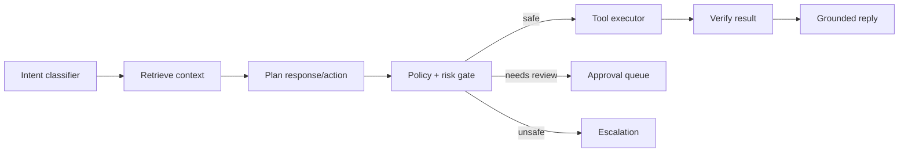

# SupportPilot Light vs Advanced Plan

## Product-tier philosophy

SupportPilot should ship a Light version first to validate the white-label RAG support wedge with near-zero infrastructure cost, then evolve into an Advanced enterprise platform with agentic actions, approval policies, RBAC, integrations, analytics, and SOC 2 readiness.

The demo repository already supports this split because it describes a preserved Lite embeddable chat path plus optional Supabase-backed auth, tickets, RAG, approval workflows, audit logs, analytics, and Sentry observability ([GitHub repository page](https://github.com/anilandcode/supportpilot-demo)).

## Light version — scope

**Goal:** launch a branded support bot for a customer in one day using pasted docs, Markdown uploads, simple RAG, a widget, a minimal admin, and email escalation.

| Area | Include | Exclude |
|---|---|---|
| Tenancy | Single org/workspace per customer, tenant ID on data | Complex agency hierarchy, sub-orgs, custom data residency |
| Knowledge | Paste FAQ, upload Markdown/text, manual reindex | Notion sync, web crawling, PDF/DOCX edge cases, scheduled refresh |
| RAG | pgvector top-K retrieval, Gemini generation, chunk citations | Reranking, hybrid search, model comparisons, advanced faithfulness evals |
| Widget | Async script, iframe fallback, brand colors, bot name/personality | Advanced SDK, authenticated user context, omnichannel identity |
| Escalation | Email escalation and optional Calendly link | Zendesk/Gorgias/Intercom writeback, Slack workflows beyond notification |
| Admin | Basic metrics, tickets table, knowledge screen, settings | Fine-grained RBAC, audit exports, complex analytics |
| Approval | Manual “draft needs review” flag for high-risk categories | Full policy engine, role queues, SLA reminders, legal workflows |
| Auth | Clerk/Supabase/Auth.js basic login | SAML/SCIM, enterprise SSO, custom IdP |
| Billing | Stripe subscriptions with plan limits | Outcome-based pricing, metered resolution billing |
| Compliance | Privacy page, DPA template, basic logs | SOC 2 audit package, regional data residency, enterprise key management |

## Light stack

| Layer | Choice | Rationale |
|---|---|---|
| App | Next.js on Vercel | The current demo is a Vercel/Next.js seed, and Vercel’s limits are enough for early admin/widget traffic ([GitHub repository page](https://github.com/anilandcode/supportpilot-demo), [Vercel limits](https://vercel.com/docs/limits)). |
| Database | Neon Postgres + pgvector | Neon Free provides 100 CU-hours/project/month and 0.5 GB storage/project, and Neon includes pgvector support on its Postgres extension list ([Neon free-plan FAQ](https://neon.com/faqs/free-plan-limits-and-quotas), [Neon pricing](https://neon.com/pricing)). |
| Auth | Clerk Free or Supabase Auth | Clerk advertises free usage up to 50k users, while Supabase Free includes 50k MAUs and unlimited API requests ([Clerk pricing](https://clerk.com/pricing), [Supabase pricing](https://supabase.com/pricing)). |
| AI | Gemini default | Gemini has free-tier project/model rate limits visible in AI Studio and supports function calling for future actions ([Gemini rate-limits docs](https://ai.google.dev/gemini-api/docs/rate-limits), [Google Gemini function-calling docs](https://ai.google.dev/gemini-api/docs/function-calling)). |
| Email | Resend | Resend Free supports 100 emails/day and 3,000 emails/month ([Resend account quotas](https://resend.com/docs/knowledge-base/account-quotas-and-limits)). |
| Analytics | PostHog Free | PostHog Free includes 1M analytics events, 5k recordings, 1M feature-flag requests, and other free quotas ([PostHog pricing](https://posthog.com/pricing)). |
| Monitoring | Sentry Free | Sentry Free includes 5k errors and unlimited users ([Sentry pricing](https://sentry.io/pricing/)). |

## Light acceptance criteria

- A new tenant can be created and configured in <10 minutes.
- A customer can paste/upload docs and receive cited answers.
- The widget installs on plain HTML, Webflow, WordPress, Shopify, Squarespace, and a Next.js app.
- The admin dashboard shows total tickets, resolved, escalated, AI acceptance %, recent tickets, and basic inbox.
- Risk categories trigger “draft for review” rather than automatic sending.
- Email escalation works reliably with transcript and citations.
- All tenant data is scoped by `tenant_id` and basic audit logs exist for admin actions.

## Advanced version — scope

**Goal:** true enterprise AI support platform with agentic workflows, multi-model routing, multi-source ingestion, guardrails, approval policies, RBAC, audit logs, analytics, integrations, and SOC 2 readiness.

| Area | Include | Enterprise bar |
|---|---|---|
| Multi-tenancy | Org/workspace/client hierarchy, role-based access, domain allowlists | RLS, scoped API keys, per-tenant retention, audit evidence |
| Knowledge | Notion, Markdown, PDF, help-center imports, URL sources, scheduled refresh | Source versioning, chunk provenance, reindex diffing, knowledge-gap detection |
| Retrieval | Hybrid vector/keyword, reranking, source filters, citation spans | Eval dashboards, failed-answer clustering, source freshness scores |
| Agentic actions | Tool registry, action schemas, idempotency, policy gates | Refunds, ticket updates, CRM updates, scheduling, status changes with approval as needed |
| Model routing | Gemini/OpenAI/Claude/Groq/OpenRouter/Together | Cost/latency/quality routing and provider fallback |
| Approval queue | Configurable policies, risk scoring, manager queues, SLA reminders | Edit/approve/reject, full audit trail, policy simulation |
| Analytics | Resolution funnel, acceptance, deflection, top intents, cost per resolution | Customer-facing reports and export APIs |
| Integrations | Slack, Calendly, Zendesk, Gorgias, Intercom, Stripe, webhooks | OAuth where needed, retries, replay, integration health |
| Security | RBAC, audit logs, PII handling, retention, rate limits | DPA, subprocessors, access reviews, incident process, SOC 2 readiness |
| Deployment | Multi-env CI/CD, preview apps, migrations, seed data | Production runbooks, rollback, uptime/latency SLOs |

## Advanced architecture additions

OpenAI documents tool calling as a multi-step application-controlled loop, and Gemini documents function calling for external actions like scheduling and sending emails ([OpenAI function-calling docs](https://platform.openai.com/docs/guides/function-calling), [Google Gemini function-calling docs](https://ai.google.dev/gemini-api/docs/function-calling)).

SupportPilot Advanced should implement an **Agent Runtime** with these internal modules:



## Include/exclude comparison

| Capability | Light | Advanced |
|---|---|---|
| Pasted FAQ | Include | Include |
| Markdown upload | Include | Include |
| Notion connector | Exclude or manual import | Include |
| PDF/DOCX ingestion | Exclude initially | Include with extraction QA |
| pgvector RAG | Include | Include as default or fallback |
| Dedicated vector DB | Exclude | Optional when scale demands it |
| Reranking | Exclude | Include |
| Citations | Chunk-level | Span/source-version-level |
| Gemini only | Include | One route among many |
| Multi-model routing | Exclude | Include |
| Email escalation | Include | Include |
| Slack escalation | Optional simple webhook | Full integration with routing |
| Calendly | Link-only | API/webhook integrated |
| Zendesk/Gorgias/Intercom | Exclude | Include as escalation/writeback targets |
| Approval queue | Simple queue | Policy engine + role queues + audit |
| RBAC | Admin/member | Owner/admin/manager/agent/viewer/custom roles |
| Audit logs | Basic | Append-only, exportable, SOC 2 evidence |
| Analytics | Basic counters | Funnel, cohorts, model cost, source quality |
| SSO/SAML | Exclude | Enterprise add-on |
| Data residency | Exclude | Enterprise architecture option |
| Voice | Exclude | Later enterprise add-on |

## Upgrade path from Light to Advanced

### Phase 1 — data model hardening

Add `tenant_id`, `workspace_id`, `source_version`, `embedding_model`, `embedding_version`, `ai_run_id`, and `audit_event_id` fields everywhere before adding advanced features.

### Phase 2 — service interfaces

Create internal interfaces for `LLMProvider`, `EmbeddingProvider`, `VectorStore`, `EscalationProvider`, `TicketProvider`, and `ToolProvider` so Gemini/pgvector/email can be swapped without rewriting product logic.

### Phase 3 — policy engine

Convert hard-coded risk categories into database-backed policies:

```ts
type ApprovalPolicy = {
  tenantId: string;
  riskCategory: string;
  minConfidenceToAutoSend: number;
  requireApproval: boolean;
  allowedActions: string[];
  approverRole: 'owner' | 'manager' | 'legal' | 'security';
};
```

### Phase 4 — model router

Introduce a router that chooses models by intent, risk, tenant plan, latency budget, and fallback state. OpenRouter can provide model-provider fallback and free-model experimentation, but direct provider keys should remain available for production cost control ([OpenRouter FAQ](https://openrouter.ai/docs/faq)).

### Phase 5 — integrations and actions

Start with low-risk tool actions such as creating tickets, tagging conversations, and sending Slack notifications, then add refunds, billing updates, and account changes only behind approval and idempotency.

### Phase 6 — enterprise controls

Add SSO, SCIM, audit exports, data retention, DPA/subprocessor documentation, incident response, access review workflows, and SOC 2 evidence automation.

## Tier-specific KPIs

| KPI | Light target | Advanced target |
|---|---:|---:|
| Setup time | < 24 hours live | < 2 weeks for enterprise integration |
| Cost per 1,000 AI answers | As low as possible with Gemini/free tiers | Tracked by route/provider/customer |
| Escalation rate | < 40% after docs cleanup | < 20% for mature knowledge base |
| Approval edit rate | Track only | < 30% after policy/source tuning |
| Citation missing rate | < 5% | < 2% |
| First response latency | < 2.5s p50 | < 2.0s p50 |
| Source freshness | Manual | Per-source SLA and stale-source warnings |

## What to avoid

- Do not build refunds, billing mutations, or SSO changes as autonomous actions in Light.
- Do not overbuild multi-region infrastructure before getting paying customers.
- Do not promise “fully automated support” for high-risk categories.
- Do not hide uncertainty; make confidence and source quality visible to admins.
- Do not lock into one AI provider; store model metadata from day one.
