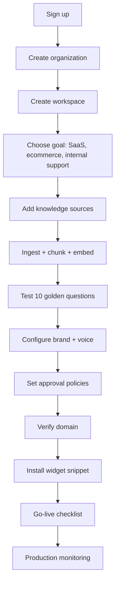
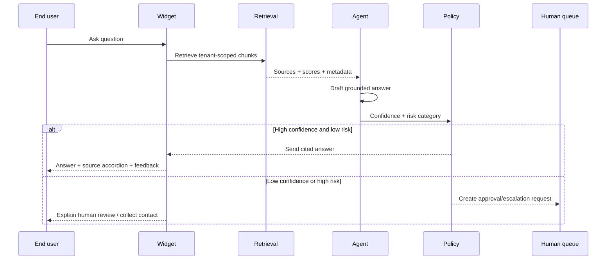
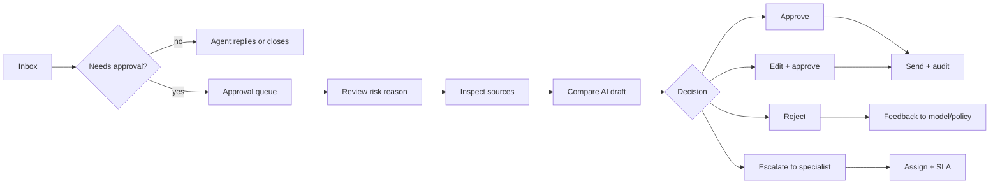
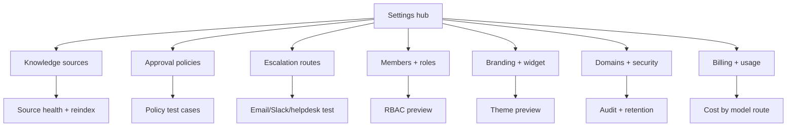

# 08 — SupportPilot Product Workflow and UX Plan

> Built to deepen the existing SupportPilot 00–06 research set; this document intentionally focuses on design, workflow, security, agentic architecture, and small-model cost strategy rather than repeating the earlier market overview.

## 1. Product UX principle

SupportPilot should feel like a guided enterprise operations tool, not a chatbot builder with an admin page attached. Intercom’s Messenger settings divide setup into widget, content, appearance, conversations, install, and security, which is a useful pattern for turning a complex support product into understandable configuration areas ([Intercom Messenger docs](https://www.intercom.com/help/en/articles/6612589-set-up-and-customize-the-messenger)). Linear’s dashboard model also shows that operational users need centralized pages combining metrics, charts, tables, and filters rather than isolated widgets ([Linear dashboards docs](https://linear.app/docs/dashboards)).

The UX north star is: “live in 24h, safe forever.” The first-run experience should get a customer from account creation to a working, cited widget in one sitting, while the admin console should continuously surface readiness, source quality, approval workload, security posture, and model cost.

## 2. Workflow A — customer onboarding: “live in 24h”

### Recommended onboarding screens

| Step | Screen | Main action | Friction reducer |
|---|---|---|---|
| 1 | Welcome | Pick workspace type and support goal | Offer templates: SaaS billing, SSO, refunds, ecommerce orders. |
| 2 | Knowledge | Paste FAQ, upload files, add docs URLs, or import sample docs | Show ingestion progress with “usable now / indexing deeper” states. |
| 3 | Test | Run golden questions against sources | Preload examples from detected content headings. |
| 4 | Brand | Set bot name, logo, primary color, tone | Live widget preview with contrast warnings. |
| 5 | Safety | Choose approval policy preset | Presets: conservative, balanced, high automation. |
| 6 | Domain | Verify customer domain and origin allowlist | DNS copy button, “send to developer,” status check. |
| 7 | Install | Copy widget snippet | Framework tabs for HTML, Next.js, Shopify, Webflow. |
| 8 | Launch | Checklist and smoke test | “Open your site and ask a test question” deep link. |

### First-run checklist

- Add at least one knowledge source.
- Generate embeddings and confirm source count.
- Answer five golden questions with citations.
- Configure brand and bot disclosure.
- Set escalation email and approval owners.
- Verify domain and allowed origins.
- Install the widget.
- Turn on PostHog/Sentry events for production observability.

### Empty states

| Empty state | Good copy | CTA |
|---|---|---|
| No knowledge | “SupportPilot needs source material before it can answer safely.” | Upload docs / paste FAQ. |
| No tickets | “Once customers ask questions, conversations and escalations appear here.” | Open test widget. |
| No approvals | “High-risk or low-confidence drafts will queue here.” | Review approval policy. |
| No analytics | “Analytics starts after your first 10 conversations.” | Run test questions. |
| No domain | “Verify a domain before production embed to prevent unauthorized widget use.” | Add domain. |

## 3. Workflow B — end-user support conversation

### UX details

The conversation should always show why the bot is confident. Every factual answer should include citation chips, and users should be able to expand a source card to see title, excerpt, URL, and last indexed time. If retrieval is weak, the widget should say it is not confident and offer escalation instead of hallucinating.

Add progressive disclosure for safety. A simple order-status or docs question can feel instant; refund, SSO, billing dispute, data residency, deletion, and legal/privacy requests should show “This may require review” early so the pending-approval state does not feel like a failure.

### Conversation states

| State | User-facing behavior | System behavior |
|---|---|---|
| Retrieving | “Checking the docs…” | Query rewriting, tenant filters, top-K retrieval. |
| Drafting | Streaming answer begins only after sources are selected. | Generate answer with citation contract. |
| Cited answer | Source chips under answer. | Store citations and retrieval event. |
| Low confidence | “I’m not confident enough to answer from the available docs.” | Create ticket and missing-doc event. |
| Approval pending | “A manager needs to approve this because it involves billing/security/privacy.” | Queue approval request with draft, sources, risk reason. |
| Escalated | Collect email or create ticket. | Notify Resend/Slack/helpdesk route. |
| Feedback | Thumbs up/down + reason. | Capture acceptance and improvement signal. |

## 4. Workflow C — human agent / manager approval flow

### Approval queue design

| Element | Requirement |
|---|---|
| Risk reason | Show the exact matched policy: “refund request over threshold,” “SSO setup,” “data residency,” “billing dispute,” “low retrieval confidence.” |
| Confidence meter | Show retrieval score, generation self-check, and policy risk separately. |
| Source panel | Show the chunks used, source URL, source owner, last indexed time, and stale warning. |
| Draft panel | Make AI draft editable inline with diff history after edits. |
| Decision buttons | Approve, edit + approve, reject, escalate; destructive actions require confirmation. |
| Audit trail | Record reviewer, time, original draft, final text, policy, citations, and model route. |

### Manager UX best practices

Managers need batchability and context. Group approvals by risk category, SLA, and customer; allow saved views like “Billing,” “Security,” and “Low confidence”; support keyboard shortcuts for approve/edit/escalate; and show policy simulation so managers can tune what enters the queue.

## 5. Workflow D — admin configuration

### Settings IA

| Section | Subsections | UX notes |
|---|---|---|
| Workspace | Name, timezone, default language, environment | Keep basic identity separate from security. |
| Knowledge | Sources, uploads, chunking, reindex, missing docs | Add source health score and stale-source warnings. |
| Approval policies | Risk categories, thresholds, manager queues, SLA | Include a policy simulator with sample tickets. |
| Escalation routes | Email, Slack, webhook, helpdesk, Calendly | Each route needs a test button and last-success timestamp. |
| Members and roles | Owner/admin/manager/agent/viewer | Show permission preview before invite. |
| Branding | Logo, colors, font, tone, disclosure | Live widget preview and contrast validation. |
| Domains | Verified domains, origin allowlist, widget keys | Show install status and latest blocked origins. |
| Security | SSO, audit logs, retention, API keys, data exports | Enterprise-only gates should be visible but not confusing. |
| Billing | Plan, usage, reply bundles, model costs | Tie usage to reply outcomes and model routes. |

## 6. Ease-of-use improvements for the current MVP

1. Replace the dashboard landing view with a “workspace health” strip: domain verified, sources indexed, approvals configured, escalation route tested, widget installed.
2. Add a setup checklist that remains pinned until launch and collapses after completion.
3. Convert settings into a hub with cards, not a long form.
4. Add sample tickets and sample knowledge for demo accounts.
5. Add saved views to Tickets and Approvals.
6. Add inline explanations for AI acceptance percent, confidence, and approval policy.
7. Add “why did this queue?” on every approval card.
8. Add a missing-knowledge loop: downvoted/low-confidence answers create suggested docs tasks.

## 7. Metrics instrumentation

| Event | Properties |
|---|---|
| `onboarding_step_completed` | workspace_id, step, time_spent, user_role |
| `knowledge_source_added` | type, size, pages, indexing_time, status |
| `rag_answer_generated` | model_route, chunks_used, citation_count, confidence, latency |
| `approval_requested` | risk_category, confidence, policy_id, ticket_id |
| `approval_decided` | decision, edit_distance, reviewer_role, SLA_time |
| `ticket_escalated` | route, reason, source_gap, priority |
| `widget_installed` | domain, environment, theme_id |
| `answer_feedback` | rating, reason, source_clicked |

## 8. Practical implementation backlog

| Priority | Item | Why it matters |
|---|---|---|
| P0 | Setup checklist + workspace health | Makes “live in 24h” believable. |
| P0 | Approval card redesign | Turns the unique approval queue into a premium feature. |
| P0 | Source/citation drawer | Builds trust in every answer and every approval. |
| P1 | Saved views and filters | Reduces manager/agent workload. |
| P1 | Policy simulator | Prevents over- or under-queuing. |
| P1 | Widget first-run preview | Lets customers validate brand and UX before install. |
| P2 | Missing-knowledge workflow | Compounds accuracy over time. |
| P2 | Command palette | Adds enterprise console speed. |
