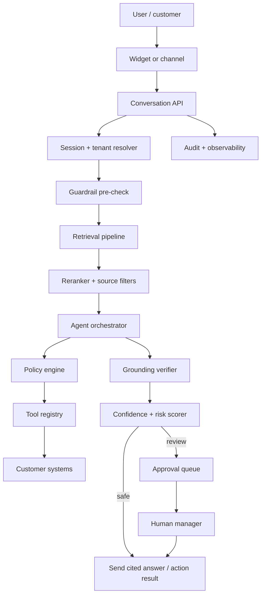
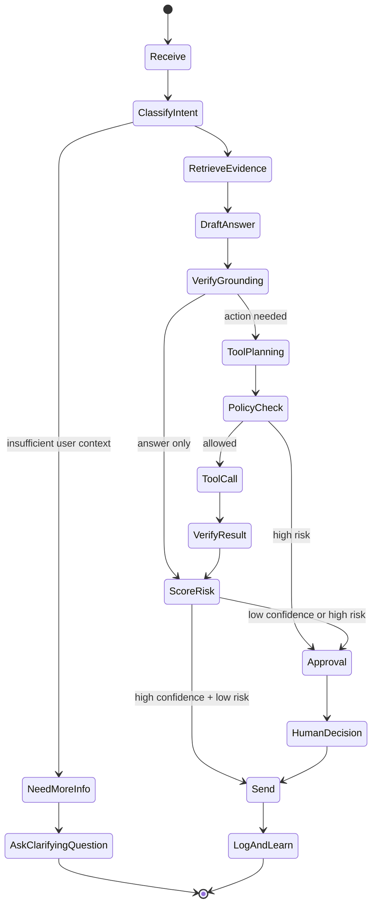
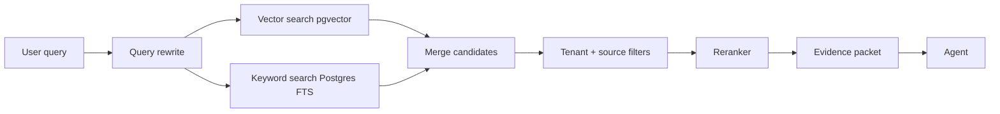
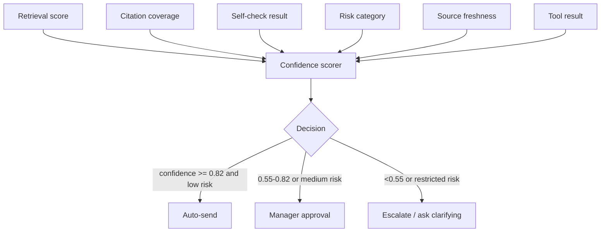

# 10 — SupportPilot True Agentic Architecture

> Built to deepen the existing SupportPilot 00–06 research set; this document intentionally focuses on design, workflow, security, agentic architecture, and small-model cost strategy rather than repeating the earlier market overview.

## 1. What “true agentic” means for SupportPilot

A plain RAG chatbot retrieves documents and writes an answer. A true SupportPilot agent retrieves evidence, reasons across multiple steps, decides whether it can answer or act, calls approved tools, checks grounding, estimates confidence and risk, and routes unsafe outcomes to a human. Vercel’s AI SDK explicitly includes tool calling so models can interact with external systems, structured outputs, streaming, and a unified provider API ([Vercel AI SDK](https://vercel.com/docs/ai-sdk)). Gemini function calling lets models decide when to call specific functions and return parameters for real-world actions such as scheduling appointments, updating user data, or interacting with databases and APIs ([Gemini function calling docs](https://ai.google.dev/gemini-api/docs/function-calling)). LangGraph is positioned as an agent orchestration framework with human-in-the-loop moderation and control for complex tasks ([LangGraph](https://www.langchain.com/langgraph)).

## 2. Agentic capabilities by maturity level

| Capability | Plain RAG | SupportPilot agentic target |
|---|---|---|
| Retrieval | Top-K chunks only | Query rewrite, hybrid search, rerank, source trust, freshness, tenant filters. |
| Reasoning | One-pass answer | Plan, retrieve, draft, verify, decide action/escalation. |
| Tools | None | Read account/order/subscription, create/update ticket, schedule call, issue safe coupon/refund draft. |
| Policy | Prompt text only | Policy engine outside the model governs risk, thresholds, and tool permissions. |
| Confidence | Model self-rating | Combined retrieval score, citation coverage, self-check, risk category, historical acceptance. |
| Human loop | Manual escalation | Approval queue driven by policy and confidence. |
| Audit | Chat transcript | Model route, sources, tool calls, policy checks, approval decisions. |

## 3. System architecture



## 4. Agent loop



## 5. Tool registry

| Tool | Type | Default policy | Audit fields |
|---|---|---|---|
| `search_knowledge` | Retrieval | Always allowed inside tenant. | query, source IDs, scores. |
| `get_ticket_history` | Read | Allowed for authenticated/known session or agent. | ticket_id, requester. |
| `create_ticket` | Write | Allowed. | ticket_id, priority, route. |
| `update_ticket_status` | Write | Agent/admin only or policy-approved. | before/after status. |
| `lookup_order` | Read | Tenant integration required; customer identity required. | order_id, fields returned. |
| `draft_refund` | Write draft | Approval required above threshold. | amount, reason, policy. |
| `issue_refund` | Write action | Human approval by default. | approver, amount, idempotency key. |
| `schedule_call` | External action | Allowed if user confirms. | calendar route, time, invitee. |
| `send_email` | Customer-visible | Auto-send only low-risk/high-confidence. | recipient, template, final text. |
| `notify_slack` | Internal | Allowed. | channel, message hash. |

## 6. Policy and guardrail layer

The policy engine should be deterministic application code, not a hidden model prompt. Use model outputs as inputs to policy, but never let the model grant itself permission.

```ts
type PolicyDecision = {
  action: "answer" | "ask_clarifying" | "approve_required" | "escalate" | "refuse";
  reasons: string[];
  requiredRole?: "manager" | "admin" | "owner";
  maxAutoRefundCents?: number;
  allowedTools: string[];
};
```

| Guardrail | Implementation |
|---|---|
| Source grounding | Answer must cite source IDs for factual claims. |
| Prompt injection | Retrieved text cannot override system/tool policy; injection patterns are logged. |
| PII | Redact before prompt, restrict tool fields, minimize logs. |
| Tool schema validation | Zod/JSON Schema validation before tool execution. |
| Idempotency | Every write tool uses idempotency keys. |
| Confirmation | User confirmation before customer-visible changes. |
| Approval | Policy gates for refund, billing, SSO, data residency, deletion, legal/security. |
| Rate limits | Per-domain/session limits before model calls. |

## 7. Retrieval + rerank architecture



| Stage | Light version | Advanced version |
|---|---|---|
| Query rewrite | Gemini or local small model. | Small local router plus fallback model. |
| Vector retrieval | pgvector top-K. | Hybrid vector + keyword with source filters. |
| Reranking | Optional; start with lexical boost. | Qwen3-Reranker-0.6B or bge-reranker local. |
| Evidence packet | Chunk text + URLs. | Source version, freshness, trust level, citations spans. |
| Eval | Manual golden questions. | Automated faithfulness/citation tests per tenant. |

## 8. Confidence scoring

Confidence should combine multiple signals rather than relying on the generator alone.

| Signal | Example calculation |
|---|---|
| Retrieval strength | Top score, score gap, number of independent sources. |
| Citation coverage | Percent of claims with source support. |
| Source freshness | Penalize stale docs for policy/pricing/security topics. |
| Risk class | Refund, billing, SSO, security, privacy, legal raise risk. |
| User identity | Anonymous users get less access to account-specific actions. |
| Tool outcome | Tool success/failure and consistency with answer. |
| Historical quality | Prior downvotes/edit rates for similar intent/source. |
| Model route | Stronger model can reduce uncertainty but does not bypass policy. |



## 9. Framework choices in 2026

| Option | Best use | Recommendation |
|---|---|---|
| Vercel AI SDK tools | Next.js-native tool calling, streaming UI, provider switching. | Use first because current stack is Next.js/Vercel and AI SDK supports tool calling and structured outputs ([Vercel AI SDK](https://vercel.com/docs/ai-sdk)). |
| LangGraph | Multi-step stateful agents, human-in-loop, controllable graphs. | Add when approval/action flows become complex or long-running ([LangGraph](https://www.langchain.com/langgraph)). |
| Gemini function calling | Free/low-cost hard-case fallback with structured tool calls. | Use as fallback and for tool-capable routes while local models mature ([Gemini function calling docs](https://ai.google.dev/gemini-api/docs/function-calling)). |
| Custom orchestrator | Maximum control, lowest dependency risk. | Keep policy, retrieval, confidence, and audit as app-owned modules even if using SDK/frameworks. |

## 10. Pragmatic implementation plan

| Phase | Build |
|---|---|
| Phase 1 | Tool registry with read-only tools, Zod schemas, audit logging, no autonomous writes. |
| Phase 2 | Confidence scorer and policy engine driving approval queue. |
| Phase 3 | Reranking and grounding verifier; add missing-source workflow. |
| Phase 4 | Low-impact write tools: create ticket, tag ticket, schedule call. |
| Phase 5 | Approval-gated financial/security tools: refund draft, SSO guidance, data residency reply. |
| Phase 6 | LangGraph or durable workflow engine for multi-step customer/account tasks. |

## 11. Database additions

| Table | Purpose |
|---|---|
| `tool_definitions` | Tool name, schema, risk class, tenant availability. |
| `tool_calls` | Tool call inputs/outputs, status, idempotency key, actor/model. |
| `agent_runs` | Plan, model route, steps, confidence, final decision. |
| `policy_evaluations` | Policy matched, thresholds, decision, reasons. |
| `grounding_checks` | Claims, supporting chunks, pass/fail. |
| `approval_requests` | Draft, reason, policy, reviewer queue, SLA. |
| `approval_decisions` | Decision, final content, reviewer, audit metadata. |

## 12. Anti-patterns to avoid

- Do not let the model directly execute refunds, account changes, or SSO/security actions.
- Do not use “agentic” to mean only a longer prompt.
- Do not hide low confidence; route it to approval or escalation.
- Do not let retrieved docs contain executable instructions for the agent.
- Do not log raw prompts and PII into analytics.
- Do not ship tool calling without idempotency, schema validation, and audit logs.
