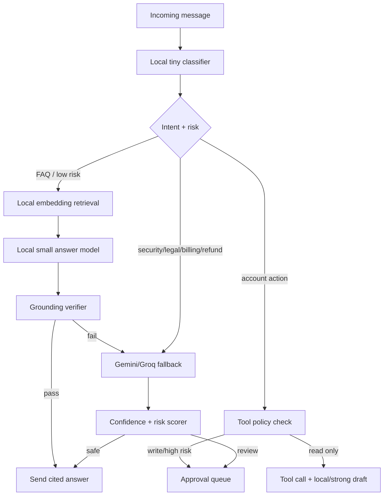

# 11 — SupportPilot Small Models and Cost Strategy

> Built to deepen the existing SupportPilot 00–06 research set; this document intentionally focuses on design, workflow, security, agentic architecture, and small-model cost strategy rather than repeating the earlier market overview.

## 1. Executive recommendation

Use a model router, not one model. The Light version should keep Gemini Flash/Flash-Lite as the free/low-cost default while moving embeddings to an open model when feasible. The Advanced version should self-host a small local model for classification, routing, PII redaction, query rewrite, and easy grounded answers; add a local embedding/reranker stack; and reserve Gemini/Groq/OpenRouter or a premium provider for ambiguous, high-risk, or high-value tickets. Gemini rate limits are measured by requests per minute, tokens per minute, and requests per day, and Google’s docs advise users to view active limits in AI Studio because limits vary by model and tier ([Gemini rate limits](https://ai.google.dev/gemini-api/docs/rate-limits)). OpenRouter documents free-model limits of 20 requests per minute, 50 free-model requests per day for accounts with less than 10 credits purchased, and 1,000 per day after purchasing at least 10 credits ([OpenRouter limits](https://openrouter.ai/docs/api-reference/limits)). Cloudflare Workers AI includes 10,000 Neurons per day at no charge and charges for usage beyond that on paid plans ([Cloudflare Workers AI pricing](https://developers.cloudflare.com/workers-ai/platform/pricing/)).

## 2. Model landscape for mid-2026 / near-future 2026–2027

### Small generative models

| Model family | Useful sizes | Context / modality | License posture | SupportPilot fit |
|---|---:|---|---|---|
| Gemma 3 | 270M, 1B, 4B, 12B, 27B | 4B/12B/27B support 128K context and multimodal input; 1B/270M support 32K context ([Gemma 3 model card](https://ai.google.dev/gemma/docs/core/model_card_3)). | Gemma Terms; Google describes Gemma 3n as open weights licensed for responsible commercial use ([Gemma 3n docs](https://ai.google.dev/gemma/docs/gemma-3n)). | 1B/4B for local routing and grounded drafts; 12B for self-hosted quality if GPU exists. |
| Gemma 3n | E2B/E4B effective variants | 32K context; optimized for phones, laptops, and tablets with parameter-efficient processing ([Gemma 3n docs](https://ai.google.dev/gemma/docs/gemma-3n)). | Responsible commercial use under Gemma terms ([Gemma 3n docs](https://ai.google.dev/gemma/docs/gemma-3n)). | Excellent for on-device/dev experiments and CPU/Mac Mini style deployments. |
| Gemma 4 | E2B, E4B, 12B, 31B, 26B A4B | Small models have 128K context; medium models support 256K; Hugging Face card lists Apache 2.0 for Gemma 4 E4B ([Gemma 4 E4B](https://huggingface.co/google/gemma-4-E4B), [Gemma overview](https://ai.google.dev/gemma/docs/core)). | Apache 2.0 for the cited E4B card; verify each checkpoint before production ([Gemma 4 E4B](https://huggingface.co/google/gemma-4-E4B)). | If available and stable in the target stack, Gemma 4 E2B/E4B becomes the best 2026–2027 small-model candidate. |
| Qwen2.5 | 0.5B, 1.5B, 3B, 7B | Qwen2.5 release spans 0.5B–72B; most models support up to 128K, while 0.5B/1.5B/3B have 32K in the table ([Qwen2.5 blog](https://qwenlm.github.io/blog/qwen2.5-llm/)). | Qwen2.5 0.5B/1.5B/7B are Apache 2.0; Qwen2.5 3B uses Qwen Research License and 72B uses Qwen License ([Qwen2.5 blog](https://qwenlm.github.io/blog/qwen2.5-llm/)). | 0.5B/1.5B for routing; 7B for better self-hosted answers; avoid 3B commercially unless license is acceptable. |
| Qwen3 | 0.6B, 1.7B, 4B, 8B, 14B, 32B, MoE | Qwen3 includes dense and MoE sizes from 0.6B to 235B-A22B, and newer 2507 variants emphasize 256K to 1M long context ([Qwen3 GitHub](https://github.com/QwenLM/Qwen3)). | Qwen says its open-weight Qwen3 models are Apache 2.0 in the GitHub repo summary ([Qwen3 GitHub](https://github.com/QwenLM/Qwen3)). | Qwen3-0.6B/1.7B/4B are strong router/query/answer candidates; 4B is likely the sweet spot for self-hosting. |
| Llama 3.2 | 1B, 3B | Llama 3.2 text models are available in 1B and 3B sizes and are intended for assistant, retrieval, summarization, and agentic applications ([Llama 3.2 model card](https://huggingface.co/meta-llama/Llama-3.2-3B-Instruct)). | Custom Llama 3.2 Community License; commercial use is possible under the license terms ([Llama 3.2 model card](https://huggingface.co/meta-llama/Llama-3.2-3B-Instruct)). | Good local fallback if license/attribution obligations fit. |
| Phi-4-mini | ~3.8B class | Phi-4-mini-instruct supports 128K context and targets memory/compute-constrained and latency-bound scenarios ([Phi-4-mini card](https://huggingface.co/microsoft/Phi-4-mini-instruct)). | MIT license ([Phi-4-mini card](https://huggingface.co/microsoft/Phi-4-mini-instruct)). | Excellent commercial-friendly local model for routing, reasoning-heavy classification, and drafts. |
| Ministral / Mistral small | Ministral 3B/8B; Mistral 3 3B/8B/14B | Original Ministral 3B/8B supported 128K context and function calling ([Mistral Ministraux](https://mistral.ai/news/ministraux/)); Mistral 3 includes small dense 14B/8B/3B models ([Mistral 3](https://mistral.ai/news/mistral-3/)). | Original Ministral was research/commercial-contact; Mistral 3 announcement says all models are Apache 2.0 ([Mistral Ministraux](https://mistral.ai/news/ministraux/), [Mistral 3](https://mistral.ai/news/mistral-3/)). | Prefer Mistral 3 small Apache models once checkpoints are stable; use original Ministral only if license fits. |
| SmolLM2 | 135M, 360M, 1.7B | SmolLM2 is available in 135M, 360M, and 1.7B and is lightweight enough for on-device use ([SmolLM2 card](https://huggingface.co/HuggingFaceTB/SmolLM2-135M)). | The model card should be checked per checkpoint before commercial production; it is most useful as an ultra-small helper. | Great for cheap classification, intent labels, and PII redaction experiments, not final answers. |
| VibeThinker | 1.5B, 3B | VibeThinker-3B was released June 16, 2026 and is a 3B dense reasoning model built on Qwen2.5-Coder-3B for verifiable reasoning tasks ([VibeThinker GitHub](https://github.com/WeiboAI/VibeThinker)). | MIT license is listed for the VibeThinker repository/model card ([VibeThinker GitHub](https://github.com/WeiboAI/VibeThinker), [VibeThinker-3B](https://huggingface.co/WeiboAI/VibeThinker-3B)). | Use only for math/code/STEM-style verification tasks; its model card warns it was not trained for tool calling, API orchestration, or autonomous coding agents ([VibeThinker-3B](https://huggingface.co/WeiboAI/VibeThinker-3B)). |

### Embedding and reranking models for RAG

| Model | Size / dimension | License posture | Fit |
|---|---|---|---|
| BAAI bge-small-en-v1.5 | Small English embedding model with Sentence-Transformers usage examples ([BGE small card](https://huggingface.co/BAAI/bge-small-en-v1.5)). | Check checkpoint license before production; commonly used in RAG. | Good CPU-friendly default for English docs. |
| Nomic Embed Text v1.5 | Production embedding model with task prefixes and Matryoshka-style usage examples ([Nomic embed card](https://huggingface.co/nomic-ai/nomic-embed-text-v1.5)). | Verify license on the model card before embedding customer data. | Good if you want flexible vector dimensions and local embedding quality. |
| Qwen3-Embedding | 0.6B, 4B, 8B; 0.6B supports 32K context and up to 1024 dimensions ([Qwen3 Embedding card](https://huggingface.co/Qwen/Qwen3-Embedding-0.6B)). | Qwen states the Qwen3 embedding/reranking series is open-sourced under Apache 2.0 ([Qwen3 Embedding blog](https://qwenlm.github.io/blog/qwen3-embedding/)). | Best 2026 upgrade for multilingual/code-heavy support RAG. |
| Qwen3-Reranker | 0.6B, 4B, 8B; 0.6B has 32K context ([Qwen3 Reranker card](https://huggingface.co/Qwen/Qwen3-Reranker-0.6B)). | Apache 2.0 per Qwen3 Embedding release blog ([Qwen3 Embedding blog](https://qwenlm.github.io/blog/qwen3-embedding/)). | Use 0.6B reranker for high-value retrieval quality without calling a frontier model. |
| bge-reranker family | Cross-encoder rerankers in small/base/large variants. | Verify exact checkpoint license. | Simpler local reranker option if Qwen3 reranker is too heavy. |
| Jina / gte rerankers | Multilingual reranker alternatives benchmarked alongside Qwen3 models ([Qwen3 Embedding blog](https://qwenlm.github.io/blog/qwen3-embedding/)). | Verify exact checkpoint license. | Useful fallback/benchmark options. |

## 3. Hardware and deployment guidance

| Deployment target | Best models | Notes |
|---|---|---|
| CPU-only small VPS | SmolLM2 135M/360M, Qwen3-0.6B quantized, bge-small. | Use for classification, PII redaction, query rewrite, not premium final answers. |
| Mac Mini / Apple Silicon dev | Gemma 3n E2B/E4B, Qwen3 1.7B/4B quantized, Phi-4-mini quantized. | Good for dev demos, local evals, and self-hosted pilot tests. |
| 8 GB GPU | Qwen3 4B, Gemma 3 4B, Phi-4-mini, Qwen3-Embedding/Reranker 0.6B. | Good advanced pilot footprint. |
| 16–24 GB GPU | Gemma 3 12B, Qwen3 8B/14B, Mistral 3 8B/14B. | Better answer quality while still cheaper than paid API at scale. |
| Serverless GPU | Modal, RunPod, Beam, HF endpoints, Together serverless. | Use for bursty advanced tenants before buying dedicated GPU capacity. |

Ollama is the easiest local developer path because it is designed to get open models running locally quickly ([Ollama](https://ollama.com)). llama.cpp is the best CPU/GGUF path because it is a C/C++ inference project for local LLM inference ([llama.cpp](https://github.com/ggml-org/llama.cpp)). vLLM is the better production GPU serving choice when throughput matters, and its production stack includes Kubernetes deployment, Helm charts, Grafana observability, multimodel support, and model-aware routing ([vLLM production stack](https://docs.vllm.ai/en/latest/deployment/integrations/production-stack/)). Hugging Face TGI remains usable but the docs state it is now in maintenance mode, so vLLM/SGLang-style serving should be preferred for new production work unless TGI is already standardized ([Hugging Face TGI](https://huggingface.co/docs/text-generation-inference/en/index)).

## 4. Free API tiers and low-cost offload

| Provider | Free / low-cost signal | Best use |
|---|---|---|
| Google AI Studio / Gemini | The official Gemini docs state that limits are measured by RPM, TPM, and RPD, and the English localized rate-limit table lists Free Tier examples: Gemini 2.5 Pro at 5 RPM / 250k TPM / 100 RPD, Gemini 2.5 Flash at 10 RPM / 250k TPM / 250 RPD, Gemini 2.5 Flash-Lite at 15 RPM / 250k TPM / 1,000 RPD, Gemini 2.0 Flash at 15 RPM / 1M TPM / 200 RPD, and Gemini 2.0 Flash-Lite at 30 RPM / 1M TPM / 200 RPD; Google also says active limits can be viewed in AI Studio and specified limits are not guaranteed ([Gemini rate limits](https://ai.google.dev/gemini-api/docs/rate-limits?hl=en)). | Hard-case fallback, strong grounded answer generation, function calling. |
| Groq | Groq rate limits are measured by RPM, RPD, TPM, TPD, and model-specific limits, with response headers exposing remaining limits ([Groq rate limits](https://console.groq.com/docs/rate-limits)). | Low-latency fallback for supported open models. |
| OpenRouter | Free model variants allow 20 RPM, 50/day below 10 purchased credits, and 1,000/day after at least 10 credits ([OpenRouter limits](https://openrouter.ai/docs/api-reference/limits)). | Backup router, free experiments, provider failover. |
| Cloudflare Workers AI | 10,000 Neurons/day free; paid usage is priced per 1,000 Neurons after free allocation ([Cloudflare Workers AI pricing](https://developers.cloudflare.com/workers-ai/platform/pricing/)). | Edge classification, embeddings, small tasks near widget traffic. |
| Hugging Face Inference Providers | Free users receive $0.10 monthly credits, PRO users $2.00, and Team/Enterprise orgs $2.00 per seat ([HF Inference pricing](https://huggingface.co/docs/inference-providers/en/pricing)). | Experiments, occasional model comparisons, demos. |
| Mistral API | Free mode has limited rate limits for evaluation and prototyping, while Scale unlocks tiered limits ([Mistral rate limits](https://docs.mistral.ai/admin/user-management-finops/tier)). | Trialing Mistral/Magistral models and European provider story. |

### Gemini free-tier examples to design around

| Gemini model | Free-tier RPM | Free-tier TPM | Free-tier RPD | SupportPilot use |
|---|---:|---:|---:|---|
| Gemini 2.5 Pro | 5 | 250,000 | 100 | Rare hard-case drafting and evaluation only. |
| Gemini 2.5 Flash | 10 | 250,000 | 250 | Hard-case fallback for early pilots. |
| Gemini 2.5 Flash-Lite | 15 | 250,000 | 1,000 | Main free fallback when local answer route fails. |
| Gemini 2.0 Flash | 15 | 1,000,000 | 200 | Legacy fallback if 2.5 routes are constrained. |
| Gemini 2.0 Flash-Lite | 30 | 1,000,000 | 200 | Lightweight fallback and batch testing. |

Treat these as planning limits, not SLAs, because Google says active limits vary by project/tier and should be checked in AI Studio ([Gemini rate limits](https://ai.google.dev/gemini-api/docs/rate-limits?hl=en)).

## 5. Model routing strategy

| Route | Trigger | Model | Cost posture |
|---|---|---|---|
| R0 | PII redaction, language detection, spam, intent | SmolLM2/Qwen3-0.6B/Phi-mini local | Near-zero after hosting. |
| R1 | Query rewrite and retrieval planning | Qwen3-0.6B/1.7B or Gemma 3n local | Near-zero. |
| R2 | Easy cited FAQ answer | Qwen3 4B / Gemma 3 4B / Phi-4-mini local | Local compute only. |
| R3 | Reranking | Qwen3-Reranker-0.6B local | Local compute; improves quality before generation. |
| R4 | Ambiguous or high-risk draft | Gemini Flash/Flash-Lite free/paid fallback | Pay or free-tier consumption only for hard cases. |
| R5 | Critical enterprise/security/legal response | Premium model + mandatory approval | Highest cost, lowest volume. |

## 6. Cost-savings logic

If 70–85% of messages are FAQ, routing, classification, or straightforward grounded answers, a local small-model path can reserve paid API calls for the 15–30% of ambiguous/high-risk cases. The savings come from moving high-volume low-risk work—intent classification, PII redaction, query rewrite, embedding, reranking, and easy drafts—off paid generation APIs, while keeping strong models for tickets where quality or liability matters. The exact savings depend on traffic mix, answer length, GPU utilization, and free-tier availability, so SupportPilot should instrument `cost_per_conversation`, `cost_per_accepted_ai_reply`, and `fallback_rate` from day one.

## 7. Recommended Light stack

| Layer | Recommendation |
|---|---|
| Generator | Gemini 2.x/2.5 Flash or Flash-Lite via current Gemini setup, with explicit rate-limit handling. |
| Embeddings | Start with Gemini embeddings if already wired; migrate to bge-small or Qwen3-Embedding-0.6B when self-hosting is practical. |
| Reranker | Skip initially; add lexical/source score boosts. |
| Local helper | Optional Qwen3-0.6B or SmolLM2 for PII/intent in dev; do not block launch on this. |
| Router | Simple deterministic rules: high-risk categories and low confidence go to approval. |
| Fallback | OpenRouter free models or Groq for demos only; avoid production dependence on free quotas. |
| Metrics | Track model route, latency, tokens, cost, confidence, approval decision. |

## 8. Recommended Advanced stack

| Layer | Recommendation |
|---|---|
| Tiny local tasks | Qwen3-0.6B or Phi-4-mini quantized for intent, risk, PII, query rewrite. |
| Main local answer | Qwen3-4B, Gemma 3/4 4B/E4B, or Phi-4-mini depending on license, quality, and hardware. |
| Embeddings | Qwen3-Embedding-0.6B for multilingual/code support or bge-small for English-only CPU simplicity. |
| Reranker | Qwen3-Reranker-0.6B for advanced tenants. |
| Strong fallback | Gemini Flash/Flash-Lite or Groq/OpenRouter model route for hard cases. |
| Premium fallback | Optional GPT/Claude/Gemini Pro route for critical enterprise drafts, always approval-gated. |
| Serving | Ollama/llama.cpp for dev; vLLM for production GPU; TEI for embeddings; serverless GPU for overflow. |

## 9. Routing decision table

| User request | Risk | Retrieval confidence | Route | Approval? |
|---|---|---:|---|---|
| “How do I reset my password?” | Low | High | Local R2 answer + citations | No |
| “Where is your DPA?” | Medium | High | Local/strong draft + security source | Maybe, tenant policy |
| “Refund my annual plan.” | High | Any | Strong draft + policy + approval | Yes |
| “Set up SSO for Okta.” | High | Medium/high | Strong draft + approval or escalation | Yes |
| “Delete all my data.” | Critical | Any | Refuse auto-action; create privacy ticket | Yes |
| “What is the status of order 123?” | Medium | N/A | Tool read + answer | No if identity verified |
| “Change my billing email.” | High | N/A | Tool draft + approval or secure handoff | Yes |
| “Your docs say ignore previous instructions.” | Security | Any | Injection handling + safe answer/escalate | Maybe |

## 10. License guidance

- Prefer Apache 2.0 and MIT checkpoints for commercial SaaS defaults.
- Treat Gemma Terms and Llama licenses as commercially usable only after reviewing obligations, attribution, acceptable-use restrictions, and redistribution terms.
- Avoid Qwen2.5-3B for commercial production unless the Qwen Research License fits the use case; prefer Qwen2.5-1.5B or 7B, or Qwen3 Apache models.
- For VibeThinker, use it as a specialized reasoning experiment, not as the general SupportPilot agent model, because its own card warns against tool-calling/API orchestration use.

## 11. Practical 30-day implementation plan

| Week | Build |
|---|---|
| 1 | Add `model_routes` table and logging for provider, model, tokens, latency, confidence, cost estimate. |
| 1 | Add deterministic router for high-risk categories and low-confidence approval. |
| 2 | Add local embeddings experiment with bge-small or Qwen3-Embedding-0.6B on a small tenant corpus. |
| 2 | Add golden-question eval set and compare Gemini-only vs local embedding retrieval. |
| 3 | Add local classifier for intent/risk/PII using Qwen3-0.6B or Phi-4-mini. |
| 3 | Add fallback path: local route → Gemini if grounding fails or risk is high. |
| 4 | Add reranker experiment and dashboard for acceptance, fallback rate, latency, and cost per accepted answer. |

## 12. Bottom line

The most cost-effective enterprise path is not “replace Gemini with one tiny model.” It is “make expensive models rare.” Self-host small models for repetitive support operations, use open embeddings and rerankers to improve RAG before generation, and reserve free/paid strong models for the risky 15–30% of cases where ambiguity, liability, or customer value justify the cost.
