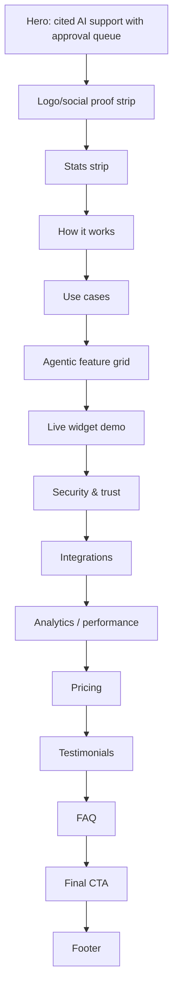

# 14 — SupportPilot Landing Page IA and Copy

## Landing-page thesis

The new landing page should sell SupportPilot as **white-label AI support that answers from approved knowledge, cites sources, routes risky drafts for approval, and goes live fast**. The page should use LynAI’s premium dashboard-in-hero style because LynAI’s template is positioned for AI tools, SaaS startups, AI chatbot tools, developer tools, automation platforms, and productivity apps ([Webflow LynAI template](https://webflow.com/templates/html/lynai-website-template)). The page should use Agentra’s structural logic because Agentra’s listing includes AI agents, features, use cases, integrations, pricing, testimonials, FAQ, CTA, blog, and contact sections for AI/SaaS/automation businesses ([Webflow Agentra0 template](https://webflow.com/templates/html/agentra0-website-template)).

## Definitive homepage IA

---

## 1. Header / navigation

**Purpose:** Make the site feel like a complete enterprise SaaS, not a one-page demo.

**Navigation:** Product, How it works, Security, Pricing, Docs, Login, Book demo, Try live demo.

**Copy direction:**

- Logo: **SupportPilot**
- Nav CTA: **Try the widget**
- Primary CTA: **Book a 20-minute demo**

**Visual/mockup needed:** Transparent glass nav over the hero that becomes white/blurred on scroll; use dark text on light hero and a violet CTA.

---

## 2. Hero: “AI support that knows when to ask for approval”

**Purpose:** Show the product’s differentiator in the first 5 seconds: RAG + citations + confidence + human approval.

**Headline options:**

1. **White-label AI support with cited answers and human approval built in.**
2. **Launch an AI support agent your customers can trust.**
3. **AI support that answers from your docs — and escalates what it shouldn’t guess.**

**Recommended headline:** **White-label AI support with cited answers and human approval built in.**

**Subhead:** SupportPilot turns your help docs, policies, and workflows into a 24/7 support agent. It answers with sources, scores confidence, and routes refunds, billing, SSO, and data-residency questions to the right human before anything risky goes out.

**Primary CTA:** Book a demo  
**Secondary CTA:** Try the live widget  
**Trust line:** Go live in 24 hours with your brand, your docs, and your escalation rules.

**Hero visual:**

- Large tilted browser mockup of `/admin` Overview with KPI cards: Deflection, AI acceptance, Escalated, Cost/conversation.
- Floating chat widget on the right showing a customer asking: “Can I get a refund on my annual plan?”
- AI answer card with citation chips and “Approval required: refund policy” badge.
- Floating mini cards: “Confidence 91%,” “3 sources cited,” “Manager approval pending,” “Slack escalation ready.”

---

## 3. Social proof / logo strip

**Purpose:** Provide enterprise credibility even before real customer logos exist.

**Headline:** Built for teams that need support automation without losing control.

**Subhead:** Works with your help center, docs, support inbox, Slack, calendar, and billing workflows.

**Logo categories if customer logos are not available:** Help centers, SaaS teams, fintech onboarding, agencies, B2B support, marketplace ops.

**Visual/mockup needed:** Muted grayscale logo placeholders or category pills; avoid fake recognizable company logos.

---

## 4. Stats strip

**Purpose:** Convert vague AI claims into operational outcomes.

**Stats copy:**

| Metric | Label | Supporting text |
|---:|---|---|
| 24/7 | AI first response | Always-on support for common questions. |
| 3 min | Setup checklist | Add docs, tune voice, embed widget. |
| 0 | Risky auto-sends | Approval gates for refunds, billing, SSO, privacy, and data residency. |
| 100% | Source-visible answers | Every factual answer should show the docs it used. |

**Visual/mockup needed:** Four compact cards with line/spark icons and subtle gradient top edge.

---

## 5. How it works

**Purpose:** Make implementation feel fast and low-risk.

**Headline:** From docs to live AI support in one guided workflow.

**Subhead:** SupportPilot keeps the setup simple for launch, then lets enterprise teams add policies, integrations, model routing, and approvals as they grow.

**Steps:**

1. **Upload your knowledge** — Paste FAQs, import Markdown, add help docs, and organize sources by workspace.
2. **Configure brand and voice** — Set your logo, colors, tone, welcome message, and domain allowlist.
3. **Set approval rules** — Decide which topics need review: refunds, billing, SSO, security, legal, and data residency.
4. **Embed and go live** — Drop in the widget script, test the live demo, and monitor tickets from the admin console.

**Visual/mockup needed:** Four horizontal step cards with mini UI fragments: source upload, brand panel, approval policy toggles, widget install snippet.

---

## 6. Use cases

**Purpose:** Show buyers how the support agent applies to real workflows.

**Headline:** One support agent for the questions that slow your team down.

**Subhead:** Start with low-risk answers, then add guarded actions and handoffs when your team is ready.

**Cards:**

| Use case | Copy | Visual |
|---|---|---|
| **SaaS support deflection** | Answer setup, pricing, account, and troubleshooting questions from your docs. | Chat answer with source chips. |
| **Billing and refund triage** | Draft policy-aware responses and route refund requests for manager approval. | Approval card with refund badge. |
| **SSO and security onboarding** | Help enterprise buyers with SAML, DPA, data residency, and access questions without guessing. | Security source drawer. |
| **Agency white-label support** | Launch a branded support widget per client workspace, with domains, roles, and policy controls. | Workspace/theme switcher. |
| **Internal support copilot** | Help human agents draft cited replies, find missing docs, and speed up ticket resolution. | Ticket detail drawer. |
| **Product feedback loop** | Identify missing knowledge, recurring intents, and docs that need refresh. | Analytics chart. |

---

## 7. Agentic features

**Purpose:** Explain why SupportPilot is more than a chatbot.

**Headline:** Not just chat. A governed support workflow.

**Subhead:** The agent retrieves evidence, drafts answers, checks confidence, follows policy, and asks humans to approve risky work.

**Feature cards:**

1. **Cited answers from your knowledge base** — Every answer shows the source chunks behind it.
2. **Confidence scoring** — Retrieval strength, citation coverage, source freshness, and risk category inform the decision.
3. **Approval queue** — Refunds, SSO, billing, privacy, legal, and low-confidence drafts wait for manager review.
4. **Human handoff** — Escalate by email, Slack, Calendly, Zendesk, or helpdesk route.
5. **Action-ready architecture** — Start with read-only actions, then add approval-gated tool calling for tickets, refunds, CRM updates, and scheduling.
6. **Small-model routing** — Use low-cost local/small models for classification, PII, query rewrite, and easy answers; reserve stronger models for hard cases.

**Visual/mockup needed:** 2x3 feature grid with mini product screenshots, not generic icons.

---

## 8. Live demo / try the widget

**Purpose:** Turn the weakest current landing page into an interactive proof section.

**Headline:** Try the same widget your customers will see.

**Subhead:** Ask about refunds, SSO setup, billing, or data residency and watch SupportPilot cite sources or ask for approval.

**Demo prompts:**

- “What is your refund policy?”
- “How do I configure SSO with Okta?”
- “Where is customer data hosted?”
- “Can I delete all my data?”

**Visual/mockup needed:** Embedded widget panel on the right; left-side checklist showing answer states: cited, low confidence, approval required, escalated.

**Important implementation note:** If the real widget cannot be embedded safely on the landing page yet, use a static interactive mock with prewritten states and a CTA to `/admin` or `/demo`.

---

## 9. Security & trust

**Purpose:** Remove enterprise objections before the pricing section.

**Headline:** Built for support teams that cannot afford hallucinated policy answers.

**Subhead:** SupportPilot is designed around human review, tenant isolation, audit trails, source visibility, and security controls.

**Trust cards:**

| Card | Copy |
|---|---|
| **RBAC and workspaces** | Owners, admins, managers, agents, and viewers get role-appropriate access. |
| **Domain allowlists** | Widgets only run on verified domains with tenant-specific configuration. |
| **Audit logs** | Track source changes, approval decisions, model routes, tool calls, and policy changes. |
| **PII-aware routing** | Redact sensitive prompts and keep risky requests out of raw analytics. |
| **SSO/SAML ready** | Enterprise plan adds SAML/SSO, SCIM-ready provisioning, and access-review workflows. |
| **Data residency path** | Advanced tenants can move toward region-specific storage and provider routing. |

**Visual/mockup needed:** Dark trust band with compliance-style cards, an audit timeline, and a policy gate diagram.

---

## 10. Integrations

**Purpose:** Show SupportPilot fits existing support operations.

**Headline:** Connect the tools your support team already uses.

**Subhead:** Start simple with docs, email, Slack, and Calendly; add helpdesk and workflow integrations as you scale.

**Integration groups:**

- Knowledge: Docs, Markdown, Notion, website/help center import, PDFs/DOCX.
- Handoff: Email, Slack, Calendly.
- Helpdesk: Zendesk, Intercom, Gorgias, Freshdesk.
- Business actions: Stripe, HubSpot, Salesforce, Linear/Jira.
- Developer: Webhooks, API keys, Vercel AI SDK tools.

**Visual/mockup needed:** LynAI-style integrations strip with logos or neutral tiles, orbiting around a SupportPilot node.

---

## 11. Analytics / performance metrics

**Purpose:** Borrow LynAI’s analytics theme and make it SupportPilot-specific.

**Headline:** Know what AI resolved, what humans changed, and what docs are missing.

**Subhead:** Track deflection, AI acceptance, escalation rate, confidence distribution, cost per conversation, and missing-knowledge clusters.

**Metric cards:**

- Deflection rate
- AI acceptance rate
- Approval edit rate
- Escalation reasons
- Missing knowledge topics
- Cost per accepted AI reply
- Source freshness score
- Model fallback rate

**Visual/mockup needed:** Analytics dashboard mockup with charts, intent bars, confidence distribution, model-cost table, and “Add doc” recommendations.

---

## 12. Pricing

**Purpose:** Make buying clear and align Light/Pro/Advanced scope.

**Headline:** Start with a branded support agent. Add enterprise controls when you need them.

**Subhead:** Every plan includes cited answers, a white-label widget, and an admin console. Higher tiers add advanced approvals, integrations, model routing, and security controls.

| Plan | Suggested price | Best for | Include | Exclude / upsell |
|---|---:|---|---|---|
| **Launch** | $49/mo | Solo SaaS, small teams, first client pilots | 1 workspace, branded widget, pasted/Markdown knowledge, cited answers, basic tickets, email escalation, simple approvals, basic analytics. | No SSO, no advanced helpdesk writeback, no custom roles. |
| **Pro** | $149/mo | Growing SaaS/support teams | 3 workspaces, multi-source ingestion, approval policies, Slack/Calendly handoff, role-based members, advanced analytics, model route logging, domain allowlist. | SAML/SCIM, data residency, custom audit exports are Enterprise. |
| **Enterprise** | Custom from $499/mo | Regulated or high-volume support orgs | SSO/SAML, custom roles, audit exports, data residency options, advanced integrations, approval-gated actions, dedicated onboarding, security review package, model/provider policy. | Priced by volume, integration scope, and residency/security needs. |

**Visual/mockup needed:** Three pricing cards with Pro highlighted. Add a small “Need an agency white-label setup?” callout under pricing.

---

## 13. Testimonials

**Purpose:** Add credibility while the product is early.

**Headline:** Designed for operators who want automation without losing judgment.

**Testimonial placeholders to replace with real quotes:**

1. “SupportPilot gave us fast AI replies without forcing us to auto-send billing or security answers.” — Head of Support, B2B SaaS
2. “The approval queue is the difference between a chatbot demo and something we can actually put in front of customers.” — Founder, SaaS agency
3. “Source visibility made our team trust the drafts faster.” — Support Ops Lead

**Visual/mockup needed:** Three cards with role-based avatars or abstract initials; no fake company logos.

---

## 14. FAQ

**Purpose:** Answer buyer objections concisely.

**Questions and answers:**

1. **How does SupportPilot avoid hallucinations?** It retrieves from your approved knowledge, cites the sources it used, checks confidence, and routes low-confidence or risky drafts for human review.
2. **Can the widget match our brand?** Yes. Configure logo, color, bot name, greeting, radius, theme mode, position, and allowed domains per workspace.
3. **What counts as a risky request?** Refunds, billing changes, SSO, security, privacy, legal, data residency, account deletion, and low-confidence answers should require approval by default.
4. **Can SupportPilot take actions in other tools?** Start with safe read-only or ticket-creation actions; advanced plans can add approval-gated tool calling for helpdesk, billing, CRM, and scheduling workflows.
5. **Does it support humans in the loop?** Yes. Drafts can be approved, edited, rejected, or escalated, and every decision should be logged for auditability.
6. **What analytics do we get?** Track deflection, acceptance, escalation, approval edit rate, missing knowledge, source freshness, model routes, latency, and cost per accepted reply.
7. **Can we use our own AI model or provider?** Enterprise customers should be able to configure provider and model-routing policies as the platform matures.
8. **Is this SOC 2 compliant?** Treat SOC 2 as an enterprise-readiness roadmap: RBAC, audit logs, access reviews, retention, PII handling, incident process, and evidence exports should be implemented before making formal claims.

**Visual/mockup needed:** Accordion in a light section; keep each answer under 80 words.

---

## 15. Final CTA

**Purpose:** End with one high-confidence action.

**Headline:** Put an AI support agent on your site without giving up control.

**Subhead:** Launch with your docs and brand first. Add approvals, integrations, analytics, and enterprise controls as your support volume grows.

**CTA buttons:** Book a demo / Try the widget

**Visual/mockup needed:** Dark gradient CTA band with chat widget mini card and approval badge.

---

## 16. Footer

**Purpose:** Make the product feel complete and procurement-ready.

**Footer columns:**

- Product: Overview, Widget, Approvals, Knowledge, Analytics, Integrations
- Solutions: SaaS support, Agencies, Enterprise support, Internal support
- Resources: Docs, Security, Changelog, Blog, Status
- Company: About, Contact, Privacy, Terms, DPA, Subprocessors

**Visual/mockup needed:** Dark footer with compact links, newsletter/demo CTA, and status pill.

## Copy rules for the final page

- Say **“cited answers”**, **“approval queue”**, **“human handoff”**, **“white-label widget”**, and **“go live in 24 hours”** repeatedly.
- Avoid vague phrases like “revolutionize support with AI” unless they are backed by a product proof visual.
- Every major section should show a real SupportPilot UI state.
- The site should feel premium but never imply risky support tasks are fully autonomous.
