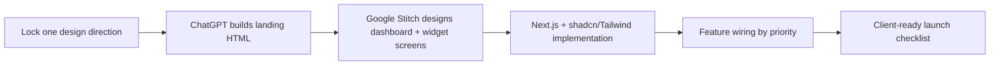

# 18 — SupportPilot Redesign Action Plan

## Goal

Execute the redesign and feature-completion effort through the user’s intended pipeline:

Use **LynAI visual direction + Agentra structure + SupportPilot enterprise trust** as the locked direction. LynAI provides the premium AI/SaaS dashboard-forward style and large section inventory ([Webflow LynAI template](https://webflow.com/templates/html/lynai-website-template)). Agentra provides the closest AI-agent/SaaS content structure with agents, workflows, features, integrations, pricing, testimonials, FAQ, blog, and CTA sections ([Webflow Agentra0 template](https://webflow.com/templates/html/agentra0-website-template)).

## Phase 0 — Lock decisions before generating UI

**Timebox:** 0.5 day

### Decisions to lock

| Decision | Final choice |
|---|---|
| Primary template direction | LynAI visual style. |
| Structural reference | Agentra IA and governance language. |
| Brand primary | Keep indigo-violet `#6D56FF`. |
| Warm accent | Add amber `#FFB24A` for marketing glow/charts only. |
| Marketing style | Vivid gradient mesh, glass cards, dashboard + widget hero, large KPI cards. |
| Console style | Restrained, light, dense, evidence-first, Vercel/Linear/Stripe/shadcn-inspired. |
| Typography | Geist or Inter. |
| Component foundation | Next.js + Tailwind + shadcn/ui + Radix primitives. |

### Output

- Confirm `13_Design_Direction_Decision.md` as the design source of truth.
- Paste the final tokens into the project `DESIGN.md`.

## Phase 1 — Generate the landing page with ChatGPT

**Timebox:** 1 day for first version, 1 day for refinement

### Steps

1. Open `15_ChatGPT_Landing_Build_Prompt.md`.
2. Paste the full prompt into ChatGPT.
3. Ask ChatGPT to output one self-contained HTML file.
4. Save the output as `landing-redesign-v1.html` locally.
5. Review for section completeness against `14_Landing_Page_IA_and_Copy.md`.
6. Request fixes with targeted follow-up prompts if needed.
7. Convert the final HTML into Next.js sections.

### Quality checklist

- Hero shows dashboard + chat widget + approval card.
- Headline says “white-label AI support with cited answers and human approval.”
- Pricing has Launch / Pro / Enterprise.
- Security section mentions RBAC, audit logs, PII, SSO/SAML, data residency path.
- Demo section shows prompts for refunds, SSO, data residency, deletion.
- Mobile layout stacks cleanly.
- No fake customer logos.
- No unsupported compliance claims.
- All CTAs are clear.

### Quick wins

- Replace current flat landing hero first.
- Add pricing and FAQ even if backend billing is not complete.
- Add static widget demo section before wiring a real demo.
- Add “Book demo” and “Try widget” CTA links to current routes.

## Phase 2 — Generate dashboard/workflow screens in Google Stitch

**Timebox:** 2–3 days

Google says Stitch can generate UI designs and front-end code from prompt and image inputs, with chat-based iteration and Figma/code export paths ([Google Developers Blog](https://developers.googleblog.com/stitch-a-new-way-to-design-uis/)). Use Stitch to produce visual references for the admin console, then rebuild the UI in Next.js rather than treating the generated output as final production code.

### Stitch generation sequence

| Order | Screen | Prompt file section | Why first |
|---:|---|---|---|
| 1 | Admin Overview | Screen 1 | Already strong in current build; easiest to polish. |
| 2 | Tickets + detail drawer | Screen 2 | Core daily workflow. |
| 3 | Approvals queue | Screen 4 | Main enterprise differentiator. |
| 4 | Knowledge | Screen 3 | RAG trust and onboarding. |
| 5 | Settings | Screen 6 | White-label and policies. |
| 6 | Widget | Screen 9 | Public product experience. |
| 7 | Analytics | Screen 5 | Pro/Enterprise value. |
| 8 | Security + Billing | Screens 7–8 | Enterprise/procurement readiness. |

### Stitch iteration rules

- Start every prompt with the global design-system prompt from `16_GoogleStitch_Dashboard_Prompts.md`.
- Generate one screen at a time.
- If Stitch drifts into dark or overly playful UI, rerun with: “Make this a light, restrained enterprise console with compact tables, thin borders, and less decorative color.”
- If Stitch creates generic AI visuals, rerun with: “Replace decorative AI art with SupportPilot product states: citations, confidence meter, approval queue, source cards, policy reason, and audit trail.”
- If colors drift, rerun with: “Use #6D56FF only for primary/action states, keep status colors from the token table, and remove unrelated colors.”

### Output

- Export screenshots/Figma/design references for each screen.
- Add images to a `/design/stitch/` folder in the actual repo.
- Create implementation tickets for components and screens.

## Phase 3 — Integrate design into Next.js

**Timebox:** 5–8 days for visible UI polish

### Implementation order

1. **Tokens and theme foundation**
   - Add CSS variables for brand, neutral, semantic, radius, shadow, spacing.
   - Add Tailwind theme extensions.
   - Create `DESIGN.md` in the repo.

2. **Shared UI primitives**
   - `Button`, `Card`, `Badge`, `StatusBadge`, `ConfidenceBadge`, `ConfidenceMeter`, `KpiCard`, `SourceCard`, `PolicyReason`, `EmptyState`, `PageHeader`.
   - shadcn/ui is suitable because it provides editable component code, and Radix provides accessible primitives for dialogs, popovers, menus, tabs, and related interactions ([shadcn/ui docs](https://ui.shadcn.com/docs), [Radix accessibility docs](https://www.radix-ui.com/primitives/docs/overview/accessibility)).

3. **Admin shell**
   - Sidebar, topbar, workspace switcher, verified domain badge, command/search, user menu.
   - Keep `/admin` structure: Overview, Tickets, Knowledge, Approvals, Analytics, Settings.

4. **Landing sections**
   - Convert generated HTML into components: `Hero`, `LogoStrip`, `Stats`, `HowItWorks`, `UseCases`, `AgenticFeatures`, `LiveDemo`, `SecurityTrust`, `Integrations`, `AnalyticsProof`, `Pricing`, `FAQ`, `FinalCTA`, `Footer`.

5. **Workflow screens**
   - Overview polish first.
   - Tickets table + drawer second.
   - Approval queue third.
   - Knowledge source health fourth.
   - Settings widget/branding and approval policies fifth.

6. **Widget UI**
   - Add citation accordion, confidence/approval states, escalation CTA, privacy footer, and mobile full-screen behavior.

### Component map

| Product area | Components to build/rebuild |
|---|---|
| Landing | Hero mockup, floating cards, pricing cards, FAQ accordion, demo widget mock. |
| Overview | KPI card, launch checklist, queue preview, missing knowledge card. |
| Tickets | Data table, filters, saved views, drawer, source panel, AI draft panel. |
| Approvals | Review queue card, confidence meter, source card, policy card, audit trail, sticky action bar. |
| Knowledge | Source table, ingestion status, chunk preview, missing-knowledge cluster, upload dropzone. |
| Analytics | Chart cards, model-cost table, quality metrics, action recommendations. |
| Settings | Settings sidebar, form sections, live widget preview, domain allowlist, contrast warning. |
| Widget | Launcher, messenger shell, message bubbles, citation accordion, escalation card, privacy footer. |

## Phase 4 — Wire features in priority order

**Timebox:** 2–6 weeks depending on current code depth

### Week 1: design + trust quick wins

- Replace landing page with new hero and section system.
- Replace all muddy pills with tokenized status/priority/confidence badges.
- Add citation cards to widget and admin draft views.
- Add approval reason, confidence meter, and source list to approval queue cards.
- Add setup checklist progress and workspace health indicators.

### Week 2: launch readiness features

- Add deterministic risk router for refunds, billing, SSO, security, privacy, legal, data residency, account deletion, and low-confidence answers.
- Add email escalation with transcript, sources, confidence, and ticket metadata.
- Add widget approval-pending and escalation states.
- Add domain allowlist enforcement and widget rate limits.
- Add model route logging fields: provider, model, route, latency, tokens, confidence, estimated cost, fallback reason.

### Week 3: RAG and knowledge quality

- Add source status/freshness, source versions, and ingestion health.
- Add missing-knowledge clusters from low-confidence/escalated tickets.
- Add golden-question evals for go-live validation.
- Add PDF/DOCX extraction preview if customer docs require it.
- Add lexical/source freshness boosts before full reranking.

### Week 4: Pro plan features

- Add Slack notifications and optional Calendly link.
- Add approval policies UI with thresholds and approver roles.
- Add Stripe plan limits for Launch and Pro.
- Add advanced analytics: acceptance, escalation reasons, approval edit rate, missing knowledge, model routes, cost per accepted reply.
- Add live widget preview and contrast validation in settings.

### Enterprise backlog

- SSO/SAML.
- Custom roles and SCIM.
- Audit exports and SOC 2 evidence package.
- Data retention and data residency options.
- Zendesk/Intercom/Gorgias writeback.
- Hybrid search + reranker.
- Approval-gated tool actions.
- Per-tenant model/provider policies.

## Phase 5 — Launch checklist

### Design QA

- Landing page matches tokens and chosen direction.
- No generic AI art dominates the page.
- Hero visually explains dashboard + widget + approval workflow.
- Console stays light, dense, and evidence-first.
- All badges use semantic tokens and include text/dot/icon.
- Widget is usable on desktop and mobile.
- Reduced-motion mode works.
- Keyboard focus states are visible.

### Product QA

- New tenant can configure workspace, docs, brand, domain, escalation, and approvals in under 24 hours.
- Widget can be installed on common site builders and Next.js.
- Cited answers show source title, excerpt, and freshness/version where available.
- Risky topics never auto-send without approval by default.
- Approval actions create audit events.
- Email escalation includes transcript and citations.
- Usage events record conversations, AI replies, approvals, escalations, sources, tokens, model routes.

### Security QA

- RLS or tenant isolation tests pass for every exposed table/API.
- Domain allowlist enforced for widget config and conversations.
- Rate limits exist for widget sessions and model calls.
- PII is minimized in analytics/logs.
- Audit log records source changes, policy changes, approvals, model routes, and tool calls.
- Compliance copy says “SOC 2 readiness path,” not “SOC 2 compliant,” unless audited.

### Sales/demo QA

- Demo workspace has realistic sources and tickets.
- Demo prompts include refund, SSO, data residency, and missing-knowledge examples.
- Pricing page matches actual Stripe plan limits.
- FAQ answers match implemented behavior.
- Book demo and Try widget CTAs are wired.

## Risks and mitigations

| Risk | Impact | Mitigation |
|---|---|---|
| ChatGPT landing output drifts from tokens | Site feels inconsistent. | Paste the full prompt; reject output that changes primary colors; manually refactor into tokenized components. |
| Stitch output becomes generic or too decorative | Dashboard loses enterprise credibility. | Start every Stitch prompt with the global design-system prompt and rerun with “evidence-first, no decorative AI art.” |
| Marketing and console feel like different products | Brand trust weakens. | Share typography, primary color, badges, cards, and product mockup language; vary intensity, not foundations. |
| White-label theming creates poor contrast | Widget becomes inaccessible for tenants. | Add contrast validation and derive accessible text variants automatically. |
| Approval workflow feels slow | Customers may think AI is not useful. | Auto-answer low-risk/high-confidence questions; only route risky or low-confidence drafts. |
| Model costs grow unexpectedly | Margins suffer. | Log model route/cost from day one; use small/local routes for classification, PII, rewrite, reranking, and easy answers. |
| RAG answers cite stale docs | Trust breaks. | Add source freshness, source versioning, stale warnings, and missing-knowledge workflow. |
| Security claims outpace implementation | Procurement and legal risk. | Use “SOC 2 readiness” until controls and audit evidence are real. |
| Generated code is not production-grade | Accessibility/maintainability issues. | Rebuild with shadcn/Radix components and Tailwind tokens; use generated output as reference only. |

## Immediate next 10 actions

1. Approve the hybrid direction: LynAI visual style + Agentra structure + indigo-violet brand.
2. Paste `15_ChatGPT_Landing_Build_Prompt.md` into ChatGPT and generate the landing HTML.
3. Pick the best landing output and convert it into Next.js sections.
4. Paste the global prompt + Screen 1 prompt from `16_GoogleStitch_Dashboard_Prompts.md` into Stitch for Overview.
5. Generate Tickets, Approvals, Knowledge, Settings, Analytics, Security/Billing, and Widget screens in that order.
6. Add design tokens and `DESIGN.md` to the actual repo.
7. Replace status/priority/confidence badges everywhere.
8. Redesign approval queue and ticket drawer around sources + confidence + policy reason.
9. Add model route/cost/confidence logging.
10. Add launch checklist QA and demo prompts before outreach.
