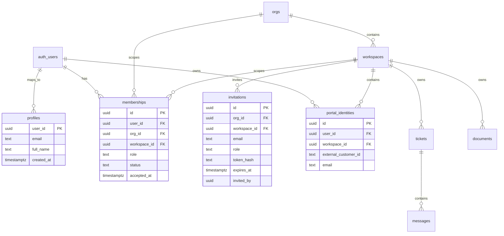
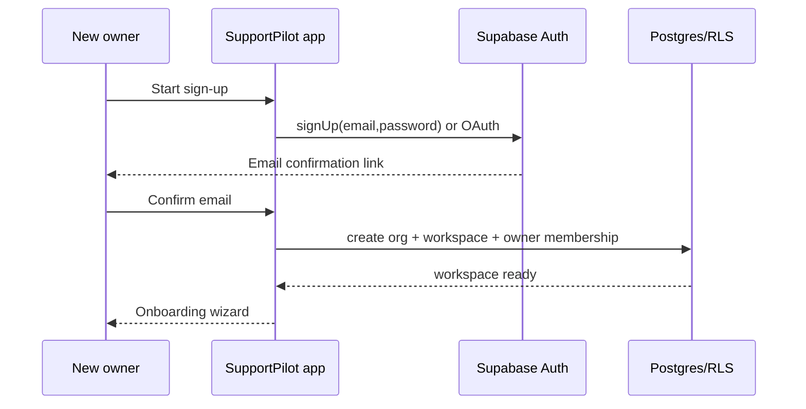
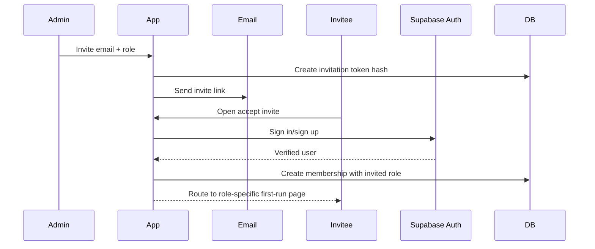
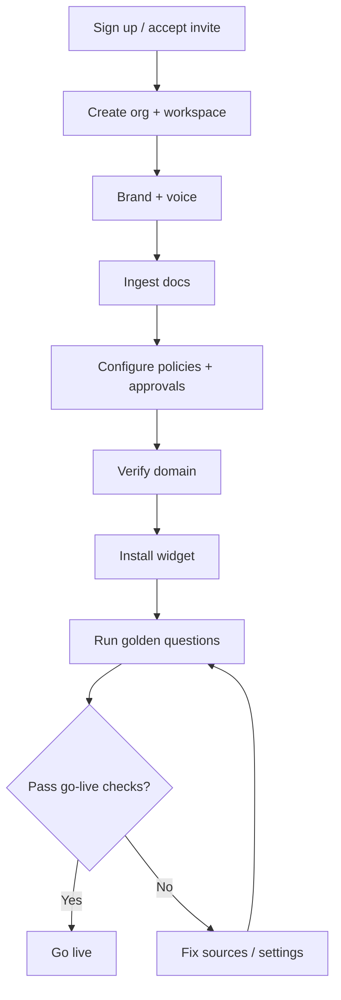

# 20 — SupportPilot Authentication and Onboarding Plan

## Executive decision

Adopt **Supabase Auth** as SupportPilot’s primary identity provider. This is the lowest-friction and lowest-cost path because SupportPilot already uses Supabase/Postgres/pgvector/RLS concepts, and Supabase Auth issues JWTs that can be used with Postgres Row Level Security for database-level authorization ([Supabase Auth](https://supabase.com/auth), [Supabase RLS docs](https://supabase.com/docs/guides/database/postgres/row-level-security)).

Supabase Free includes 50,000 monthly active users, while Supabase Pro starts at $25/month and includes 100,000 monthly active users before $0.00325 per MAU overage ([Supabase pricing](https://supabase.com/pricing)). Clerk’s current pricing page advertises free usage up to 50,000 monthly retained users, Pro at $20/month annually or $25/month monthly, and MRU overage starting at $0.02/MRU/month above the included threshold, so Supabase remains the better fit when SupportPilot wants auth, tenant data, and RLS in one system ([Clerk pricing](https://clerk.com/pricing)).

## Auth cost note: stay free until X, then Y

| Stage | Recommended auth stack | Cost posture | Trigger to change |
|---|---|---|---|
| Demo → first production customers | Supabase Auth Free | $0 for up to 50,000 MAU. | Upgrade when production reliability, backups, no pause, higher MAU, or SAML SSO is needed. |
| Early paid SaaS | Supabase Pro | From $25/month, 100,000 MAU included, then $0.00325/MAU. | Add SAML for enterprise tenants or exceed Pro quotas. |
| Enterprise SSO path A | Supabase SAML on Pro+ | SAML is available on Pro and above; Supabase pricing lists 50 included SSO MAUs and $0.015/SSO MAU overage on Pro ([Supabase SAML docs](https://supabase.com/docs/guides/auth/enterprise-sso/auth-sso-saml), [Supabase pricing](https://supabase.com/pricing)). | Use when enterprise SSO user count is modest and Supabase SAML covers the IdP. |
| Enterprise SSO path B | WorkOS on top of Supabase membership model | WorkOS AuthKit/user management is free up to 1 million users, while SSO and Directory Sync are priced per enterprise connection, starting at $125/connection/month for 1–15 connections ([WorkOS pricing](https://workos.com/pricing)). | Use when SCIM/Directory Sync, IT-admin portal, or multi-IdP enterprise onboarding matters more than lowest SSO MAU cost. |

**Recommendation:** stay on Supabase Auth for email/password, magic links, social OAuth, password reset, email verification, sessions, RLS, and early SAML. Add WorkOS later only for enterprise tenants that require IT-admin self-service, SCIM/Directory Sync, or a more mature enterprise identity workflow.

## Role model

SupportPilot needs two identity populations:

1. **Internal tenant users**: owner, admin, manager, agent.
2. **External customer users**: customer portal users who create/view their own tickets and chats.

### Roles and permissions

| Role | Scope | Core permissions | Default route |
|---|---|---|---|
| Owner | Org + all workspaces | Billing, delete org/workspace, security settings, SSO, retention, audit exports, all admin permissions. | `/admin` |
| Admin | Workspace or org | Members, workspace settings, branding, knowledge, integrations, policies, usage. | `/admin` |
| Manager | Workspace | Ticket queues, approvals, analytics, high-risk drafts, audit read. | `/admin/approvals` |
| Agent | Workspace | Inbox, ticket detail, customer metadata, drafts, internal notes, low-risk replies. | `/admin/tickets` |
| Customer | Portal workspace | Own conversations, own tickets, own profile, attachments, authenticated widget sessions. | `/portal` |

### Data model



### Membership rules

| Rule | Requirement |
|---|---|
| First user | First user who creates an org becomes `owner`. |
| Workspace membership | Every internal user must have one membership per workspace they can access. |
| Customer portal identity | Customer users are scoped to a workspace and can only access their own tickets/conversations. |
| Role changes | Only owner/admin can invite or change roles; only owner can transfer/delete ownership. |
| Deactivation | Membership status becomes `disabled`; auth account can remain for other orgs/workspaces. |
| Service-role usage | Service role can run background jobs only through server-side services and must never reach browser/widget. |

## RLS design

Supabase warns that RLS must be enabled on exposed schemas and that unauthenticated requests evaluate `auth.uid()` as `null`, so policies should be explicit about authenticated access ([Supabase RLS docs](https://supabase.com/docs/guides/database/postgres/row-level-security)).

### Helper functions

Use security-definer helper functions for role checks so policies stay readable and performant. Supabase’s RLS best-practices guidance recommends indexing columns used in policies and wrapping JWT functions like `auth.uid()` in `select` when appropriate for performance ([Supabase RLS performance guidance](https://supabase.com/docs/guides/troubleshooting/rls-performance-and-best-practices-Z5Jjwv)).

```sql
-- Sketch only; implement via migrations.
has_workspace_role(workspace_id uuid, roles text[]) returns boolean
is_org_owner(org_id uuid) returns boolean
is_customer_for_workspace(workspace_id uuid) returns boolean
```

### RLS policy matrix

| Table group | Customer | Agent | Manager | Admin | Owner |
|---|---|---|---|---|---|
| `orgs` | No access | Read via membership | Read via membership | Read/update non-billing settings | Full except irreversible deletes require confirmation |
| `workspaces` | Public portal config only | Read assigned | Read assigned | Read/update assigned | Full |
| `memberships` | Own profile only | Own membership | Workspace member list read | Invite/update non-owner roles | Full role management |
| `invitations` | Accept own invite only | No | No | Create/revoke for workspace | Full |
| `tickets` | Own tickets only | Assigned/workspace tickets | Workspace tickets | Workspace tickets | Workspace tickets |
| `messages` | Own conversation messages | Workspace ticket messages | Workspace ticket messages | Workspace ticket messages | Workspace ticket messages |
| `documents/chunks/embeddings` | No direct access | Read approved sources in workspace | Read approved sources | Manage sources | Manage sources |
| `approval_requests` | No direct access | Own drafts/read assigned | Review/approve | Review/configure | Review/configure |
| `billing/subscriptions` | No | No | Read usage only | Read usage | Full billing |
| `audit_logs/security_events` | No | Own actions | Read relevant workspace events | Read/export workspace | Full export |
| `integration_accounts` | No | No secrets | No secrets | Configure | Configure/delete |

### RLS policy examples

```sql
-- Tickets: internal members can read workspace tickets.
create policy "workspace members read tickets"
on tickets for select to authenticated
using (
  has_workspace_role(tickets.workspace_id, array['owner','admin','manager','agent'])
);

-- Tickets: customers can read only their own portal tickets.
create policy "customers read own tickets"
on tickets for select to authenticated
using (
  requester_user_id = (select auth.uid())
  and is_customer_for_workspace(tickets.workspace_id)
);

-- Approval decisions: only manager/admin/owner can approve.
create policy "reviewers can approve drafts"
on approval_decisions for insert to authenticated
with check (
  has_workspace_role(approval_decisions.workspace_id, array['owner','admin','manager'])
);
```

## Next.js session and route-protection plan

Supabase recommends cookie-based server-side auth for SSR and describes separate browser and server clients for Next.js apps ([Supabase SSR client docs](https://supabase.com/docs/guides/auth/server-side/creating-a-client)). Supabase’s SSR guidance says to use `getClaims()` to protect pages and user data and not to trust `getSession()` inside server code such as Proxy/middleware because session data may not be revalidated there ([Supabase SSR client docs](https://supabase.com/docs/guides/auth/server-side/creating-a-client)).

### Route groups

| Route | Access rule | Redirect if unauthenticated | Redirect if wrong role |
|---|---|---|---|
| `/admin/**` | owner/admin/manager/agent | `/login?next=/admin...` | `/portal` or `/unauthorized` |
| `/admin/settings/billing` | owner only | `/login` | `/admin` |
| `/admin/settings/security` | owner/admin | `/login` | `/admin` |
| `/admin/approvals` | owner/admin/manager | `/login` | `/admin/tickets` |
| `/portal/**` | customer or internal user preview | `/portal/login` | `/admin` if internal-only account |
| `/embed/**` | public widget with signed workspace/session checks | none | blocked origin response |
| `/auth/**` | public | n/a | n/a |
| `/onboarding/**` | authenticated owner/admin during setup | `/login` | `/admin` |

### Middleware/proxy responsibilities

1. Read/refresh Supabase auth cookies.
2. Verify claims with `getClaims()`.
3. Resolve active org/workspace from URL, cookie, or default membership.
4. Load role from `memberships` server-side.
5. Block unauthorized route access.
6. Ensure service-role queries are only used in server actions/route handlers.
7. Attach audit context: actor ID, workspace ID, request ID.

## Auth flows by persona

### Owner/admin sign-up → create org/workspace



Flow:

1. User chooses `Create workspace` from landing page.
2. User signs up with email/password, magic link, or social OAuth.
3. Email confirmation is required before workspace creation for production.
4. After confirmation, app creates `profile`, `org`, `workspace`, and `owner` membership in one server-side transaction.
5. User lands in `/onboarding/create-workspace` if the workspace record is incomplete.

Supabase email/password auth supports email sign-up, configurable email verification, and password reset flows ([Supabase password auth docs](https://supabase.com/docs/guides/auth/passwords)). Supabase passwordless auth supports Magic Links and OTPs, and Magic Links are one-time use by default ([Supabase magic link docs](https://supabase.com/docs/guides/auth/auth-magic-link)). Supabase supports common social OAuth providers including Google, GitHub, Apple, Azure/Microsoft, Slack, and custom OAuth/OIDC providers ([Supabase social login docs](https://supabase.com/docs/guides/auth/social-login)).

### Agent/manager/admin invite flow



Requirements:

- Invite tokens are single-use, hashed in DB, workspace-scoped, and expire in 7 days.
- Accept-invite supports existing authenticated users and new users.
- Invited user cannot choose a higher role than the invite grants.
- Accepting invite creates a `membership` and audit event.
- If invite email differs from authenticated email, require explicit admin override or block acceptance.

### Customer portal registration/login

Customer portal auth is separate in UX but still backed by Supabase Auth and workspace-scoped `portal_identities`.

Flow:

1. Customer visits `/portal/:workspaceSlug` or tenant custom portal domain.
2. Customer registers with email/password or magic link.
3. Email verification is required before account-specific ticket access.
4. Customer can create/view only their own tickets and chats.
5. Customer can optionally start anonymous widget chat; account linking happens after email verification.

### Agent login

1. Agent goes to `/login`.
2. App authenticates via Supabase Auth.
3. Middleware finds memberships.
4. If one workspace, redirect to `/admin/tickets`.
5. If multiple workspaces, show workspace switcher.
6. If no memberships, show “No workspace access” with support contact.

### Manager login

1. Manager goes to `/login`.
2. App verifies role and redirects to `/admin/approvals` if there are pending approvals.
3. Manager can access tickets, approvals, analytics, and audit-read views.
4. Manager cannot change billing, security, SSO, or owner settings.

### Admin/owner login

1. Admin/owner logs in.
2. App verifies membership and role.
3. Owner gets billing/security/retention/export controls.
4. Admin gets workspace settings but not owner transfer/delete or billing plan changes unless explicitly granted.

## Email verification, password reset, magic link, and OAuth

| Capability | Plan |
|---|---|
| Email verification | Required for all production sign-ups and customer portal account access. |
| Password reset | `/forgot-password` sends Supabase reset email; `/reset-password` requires a recovery session and updates password. Supabase documents `resetPasswordForEmail()` and then `updateUser()` after the recovery session ([Supabase reset password reference](https://supabase.com/docs/reference/javascript/auth-resetpasswordforemail)). |
| Magic link | Offer as login option for customers and internal users who prefer passwordless. Magic Links and OTPs are supported by Supabase Auth ([Supabase magic link docs](https://supabase.com/docs/guides/auth/auth-magic-link)). |
| Social OAuth | Start with Google and GitHub for admins; consider Microsoft for enterprise. Supabase lists Google, GitHub, Azure/Microsoft, Slack, and custom OAuth/OIDC providers among supported social login options ([Supabase social login docs](https://supabase.com/docs/guides/auth/social-login)). |
| MFA | Add TOTP before broad enterprise rollout; defer phone MFA because Supabase pricing lists advanced phone MFA as a paid add-on ([Supabase pricing](https://supabase.com/pricing)). |
| Reauthentication | Require step-up before owner transfer, SSO changes, retention deletion, integration secret reveal, and audit export. |

## Enterprise SSO/SAML/SCIM path

### Cheapest sequence

1. **Phase 1–2:** Supabase Auth email/password, magic link, OAuth, roles, RLS.
2. **Phase 3:** Supabase SAML for first enterprise tenants because it stays inside the existing Supabase identity/RLS model and is available on Pro+ ([Supabase SAML docs](https://supabase.com/docs/guides/auth/enterprise-sso/auth-sso-saml)).
3. **Phase 4:** Add WorkOS for tenants that demand SCIM/Directory Sync or IT-admin self-service; WorkOS prices SSO and Directory Sync per connection, starting at $125/connection/month for 1–15 connections ([WorkOS pricing](https://workos.com/pricing)).
4. **Phase 5:** Add enforced SSO by verified domain, JIT provisioning, group-to-role mapping, emergency owner bypass, and quarterly access reviews.

### SSO role mapping

| IdP signal | SupportPilot mapping |
|---|---|
| Verified domain | Auto-route to tenant SSO login. |
| SAML group claim | Map to owner/admin/manager/agent; default to agent if unmapped and allowed. |
| SCIM group | Provision/deprovision membership and role. |
| IdP deactivation | Disable SupportPilot membership within 15 minutes after sync/webhook. |
| Break-glass owner | One non-SSO emergency owner account with strong MFA and audit alert. |

## Live-in-24h onboarding wizard



### Wizard steps

| Step | Screen | Required fields | Exit criteria |
|---|---|---|---|
| 1 | Create workspace | Org name, workspace name, support URL, timezone. | Workspace exists; owner membership exists. |
| 2 | Brand + voice | Logo, primary color, bot name, welcome message, escalation language. | Widget preview passes contrast checks. |
| 3 | Ingest docs | Paste FAQ, upload md/txt/pdf, or import starter pages. | At least one approved source indexed. |
| 4 | Configure policies | Low-confidence threshold, risky categories, manager queue, escalation email. | Default safety policies saved. |
| 5 | Invite team | Invite agents/managers/admins. | At least one manager/admin for approvals or owner confirms solo mode. |
| 6 | Verify domain | Domain, DNS TXT/CNAME proof or manual verification. | Domain status `verified`. |
| 7 | Install widget | Script snippet, embed preview, portal URL. | Widget session works from verified origin. |
| 8 | Golden questions | 10–50 known questions with expected sources. | Pass threshold: grounded answer or correct escalation. |
| 9 | Go live | Final review. | Workspace health becomes `live`. |

### First-run and empty states

| Area | Empty state |
|---|---|
| No workspace | “Create your first SupportPilot workspace” with 3-step explainer. |
| No sources | “Add your first approved source” with paste/upload/sample options. |
| No tickets | “Install widget or create a test ticket.” |
| No approvals | “Risky or low-confidence drafts will appear here.” |
| No teammates | “Invite your first manager or agent.” |
| No domain | “Verify a domain before production widget traffic.” |
| Failed golden questions | Show missing source, weak citation, or risk-policy reason. |

## Acceptance criteria

### Auth

- [ ] A new owner can sign up, verify email, create org/workspace, and land in onboarding.
- [ ] Existing users can log in with email/password.
- [ ] Password reset works end to end.
- [ ] Magic link works for portal and admin login.
- [ ] Google OAuth works for internal users if enabled.
- [ ] Session cookies are SSR-safe and server route protection uses verified claims.
- [ ] Logout invalidates local session and redirects to correct login route.
- [ ] No unauthenticated user can access `/admin/**`, `/portal/account/**`, or API routes requiring identity.

### Roles and RLS

- [ ] Customer can only read/create own portal tickets and messages.
- [ ] Agent can read assigned/workspace tickets but cannot approve high-risk drafts or change settings.
- [ ] Manager can approve/edit/reject/escalate drafts but cannot change billing/security.
- [ ] Admin can manage workspace settings, sources, integrations, policies, and non-owner members.
- [ ] Owner can manage billing/security/SSO/retention/audit exports.
- [ ] Cross-workspace and cross-org read/write attempts fail at the database layer.
- [ ] Service-role endpoints are unavailable from browser bundles.

### Onboarding

- [ ] New workspace can reach `live` state from a clean Supabase project without seed data.
- [ ] Wizard supports save/resume.
- [ ] User cannot go live without at least one approved source, verified domain, passing widget check, and golden-question result.
- [ ] Invite accept flow creates membership and audit event.
- [ ] Empty states guide first-time users to the next action.

## Test checklist

### Unit tests

- [ ] Role permission matrix.
- [ ] Invite token hashing/expiry.
- [ ] Workspace slug uniqueness.
- [ ] Role transition rules.
- [ ] Route-guard role resolution.

### Integration tests

- [ ] Supabase sign-up with email confirmation.
- [ ] Password reset with redirect URL.
- [ ] Magic link login.
- [ ] OAuth callback creates/links profile.
- [ ] Invite accept as new user.
- [ ] Invite accept as existing user.
- [ ] Membership disabled blocks access.

### RLS tests on clean Supabase project

Create four users and one customer across two workspaces:

- `owner_a@supportpilot.test`
- `admin_a@supportpilot.test`
- `manager_a@supportpilot.test`
- `agent_a@supportpilot.test`
- `customer_a@supportpilot.test`
- `agent_b@supportpilot.test` in another workspace

Run automated SQL/API tests:

- [ ] Anonymous cannot read tenant tables.
- [ ] Customer A cannot read customer B ticket.
- [ ] Agent A cannot read Workspace B ticket.
- [ ] Agent A cannot insert approval decision.
- [ ] Manager A can insert approval decision in Workspace A only.
- [ ] Admin A can create source in Workspace A only.
- [ ] Owner A can read billing rows for Org A only.
- [ ] Disabled membership loses access immediately after token refresh or next request.

## Implementation sequence

1. Create auth route map and role matrix.
2. Add profile/membership/invitation/portal identity migrations.
3. Implement Supabase SSR clients and middleware/proxy.
4. Implement sign-up, login, logout, forgot/reset password, magic link, OAuth.
5. Implement create-org/workspace transaction.
6. Implement invite/accept invite.
7. Implement RLS helpers and policies.
8. Build onboarding wizard.
9. Add RLS test harness and CI gate.
10. Run clean-project migration rehearsal.

## Done means

Authentication is production-complete only when a clean Supabase project can onboard a new owner, create a real workspace, invite a real agent/manager/admin, register a customer, enforce every role through RLS, complete the onboarding wizard, and pass the full RLS test matrix without relying on seeded demo data.
