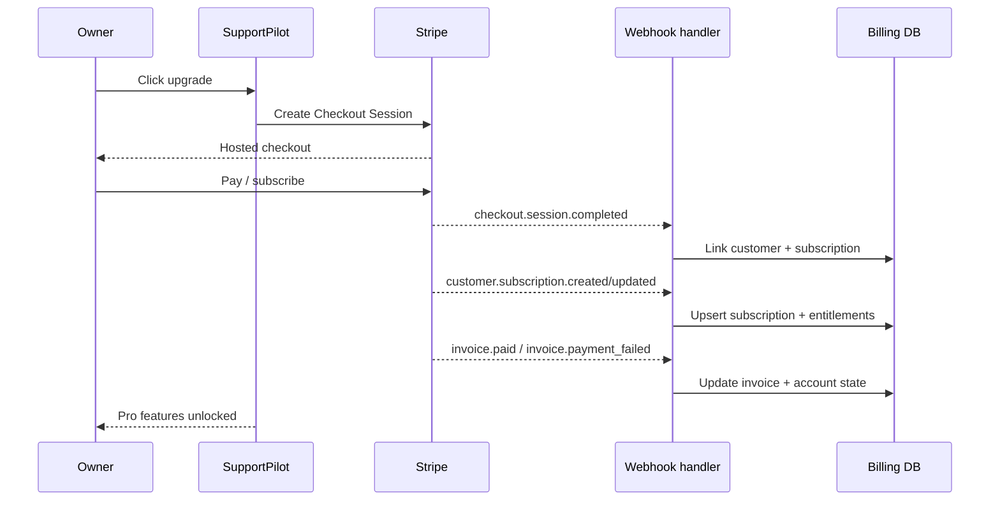

# 21 — SupportPilot Billing and Stripe Lifecycle Plan

## Goal

Turn the current billing page, tier copy, usage limits, and optional Stripe portal handoff into a complete production billing system: pricing catalog, checkout, subscription state, invoices, webhooks, usage enforcement, dunning, plan changes, and entitlement sync.

Stripe Billing is appropriate because it supports subscriptions, invoices, usage-based billing patterns, a customer portal, and subscription webhooks ([Stripe Billing docs](https://docs.stripe.com/billing)). Stripe Checkout and the Customer Portal are included as hosted Stripe flows for taking payments and letting customers manage subscriptions, which keeps SupportPilot’s first production billing implementation lightweight ([Stripe Billing pricing](https://stripe.com/billing/pricing)).

## Tier mapping

Use the feature matrix’s Launch / Pro / Enterprise structure as the commercial source of truth ([17 feature matrix](./17_Feature_Set_Matrix.md)). Keep the initial billing model simple: flat monthly subscription with internal usage limits, not complex metered billing on day one.

| SupportPilot tier | Stripe product | Billing model | Target customer | Initial entitlements |
|---|---|---|---|---|
| Free demo | No paid product | Internal/demo only | Portfolio demos and trials | 1 workspace, sample data, low limits, no custom domain, no production SLA. |
| Launch | `supportpilot_launch` | Monthly/annual recurring price | Small business / first client | 1 workspace, 2–3 seats, widget, portal, docs, cited answers, email escalation, basic approvals, basic analytics. |
| Pro | `supportpilot_pro` | Monthly/annual recurring price | SaaS/ecommerce/agency | More seats/workspaces, Slack escalation, approvals, analytics, more sources/conversations, golden questions, higher model quota. |
| Enterprise | `supportpilot_enterprise` | Manual quote or custom Stripe price | SSO, audit, integrations, volume | Custom limits, SSO/SAML, SCIM path, Zendesk/Intercom, retention/export, security review. |

## Stripe object model

| Stripe object | SupportPilot table | Purpose |
|---|---|---|
| Product | `billing_products` | Maps Stripe product to internal tier. |
| Price | `billing_prices` | Monthly/annual price, currency, trial settings. |
| Customer | `stripe_customers` | Maps `org_id` to Stripe customer. |
| Checkout Session | `billing_checkout_sessions` | Tracks started and completed purchases. |
| Subscription | `subscriptions` | Source of truth for plan status, price, current period, cancel state. |
| Invoice | `invoices` | Payment state, failed invoices, receipts, tax/invoice metadata. |
| Entitlements | `entitlements` | Derived limits used by app runtime. |
| Usage event | `usage_events` | Internal metering for quota enforcement and analytics. |
| Webhook event | `stripe_webhook_events` | Idempotency and replay audit. |

## Billing flow



Stripe recommends using webhooks for subscription activity because many billing events happen asynchronously, including payment failures and subscription status changes ([Stripe subscription webhooks](https://docs.stripe.com/billing/subscriptions/webhooks)). Stripe webhook endpoints should verify the `Stripe-Signature` header using the endpoint secret and raw request body to confirm events came from Stripe ([Stripe webhook signature docs](https://docs.stripe.com/webhooks/signature)).

## Checkout plan

### Create checkout session

When an owner chooses Launch or Pro:

1. Confirm user has `owner` role for the org.
2. Create or reuse Stripe customer for `org_id`.
3. Create Checkout Session with selected Stripe `price_id`.
4. Store `checkout_session_id`, `org_id`, `price_id`, actor, and status `created`.
5. Redirect owner to Stripe Checkout.
6. On success, show `Processing subscription...` until webhook confirms entitlements.

### Free trial and upgrade UX

| UX state | Behavior |
|---|---|
| Free/demo workspace | Show usage limits and upgrade CTA in billing/settings. |
| Trial | Show days remaining, included quota, and “add payment method” CTA. |
| Checkout completed but webhook pending | Show temporary “Activating plan” state; poll subscription endpoint. |
| Paid active | Unlock tier entitlements immediately after webhook sync. |
| Payment failed | Keep grace access for configured period, show dunning banner, block net-new usage after grace. |
| Canceled | Keep access until `current_period_end` if cancel-at-period-end. |

## Customer portal

Use Stripe’s Customer Portal for payment method updates, invoices, plan cancellation, and simple subscription management. Stripe Billing includes the customer portal in the listed Billing feature set ([Stripe Billing pricing](https://stripe.com/billing/pricing)).

Portal launch rules:

- Only owner can open portal.
- Portal session uses the org’s mapped Stripe customer.
- Return URL is `/admin/settings/billing`.
- After return, app re-fetches internal subscription state; never trust the browser redirect alone.

## Webhook event handling

| Event | Action | Idempotency key | Entitlement impact |
|---|---|---|---|
| `checkout.session.completed` | Mark checkout complete, link customer, store subscription ID. | Stripe event ID + session ID | Pending until subscription event. |
| `customer.subscription.created` | Create subscription row. | Stripe event ID + subscription ID | Set tier and status. |
| `customer.subscription.updated` | Update price, status, cancellation, period. | Stripe event ID + subscription ID + updated timestamp | Recompute entitlements. |
| `customer.subscription.deleted` | Mark canceled/deleted. | Stripe event ID + subscription ID | Downgrade at period end or immediately if deleted. |
| `invoice.paid` | Mark invoice paid and clear dunning state. | Stripe event ID + invoice ID | Restore active access. |
| `invoice.payment_failed` | Mark payment failed, start grace/dunning. | Stripe event ID + invoice ID | Soft-limit after grace. |
| `customer.updated` | Sync billing email/name/tax metadata. | Stripe event ID + customer ID | No direct change. |
| `price/product.updated` | Optional catalog sync. | Stripe event ID + object ID | Update display/config only. |

### Webhook guardrails

- Verify Stripe signature before parsing business logic.
- Store every event ID and ignore duplicates.
- Use raw request body for signature verification.
- Process webhooks server-side only.
- Put failed event processing into a retry queue or manual replay dashboard.
- Never update entitlements from client-side success URLs.
- Add a nightly reconciliation job that fetches active Stripe subscriptions and compares them with internal rows.

## Entitlements and usage enforcement

| Entitlement | Launch | Pro | Enterprise |
|---|---:|---:|---:|
| Workspaces | 1 | 3–10 | Custom |
| Seats | 2–3 | 10–25 | Custom |
| Monthly conversations | Low fixed limit | Higher fixed limit | Custom / contracted |
| AI drafts | Low fixed limit | Higher fixed limit | Custom |
| Sources/docs | Limited | Higher | Custom |
| File size | Small PDFs | Larger PDFs | Custom |
| Integrations | Email | Email + Slack + webhooks | Zendesk/Intercom/CRM/SSO |
| Retention | Default | Default + configurable soon | Contracted |
| Model routing | Free/low-cost routes | Better fallback quota | Tenant-specific provider policy |

### Enforcement rules

1. Use `entitlements` table for runtime checks, not raw Stripe objects.
2. Record every quota-consuming action in `usage_events`.
3. Aggregate usage daily and increment real-time counters for hot limits.
4. Enforce at API boundaries: chat, AI draft, ingestion, seats, workspace creation, integrations.
5. Show soft warnings at 80% and 100% of quota.
6. Allow owner/admin to upgrade in context when blocked.

### Usage event schema

```txt
usage_events
- id
- org_id
- workspace_id
- event_type: conversation | ai_reply | model_tokens | source_ingest | seat | integration_action
- quantity
- unit
- actor_user_id
- metadata_json
- occurred_at
- billing_period_start
- billing_period_end
```

## Test mode vs live mode

| Area | Test mode | Live mode |
|---|---|---|
| API keys | `sk_test`/`pk_test` only | `sk_live`/`pk_live` only |
| Webhook endpoint | Local CLI + staging endpoint | Production HTTPS endpoint in Stripe Workbench |
| Webhook secret | Test endpoint secret | Live endpoint secret |
| Products/prices | Test catalog | Live catalog with locked IDs in env/config |
| Cards | Stripe test cards | Real payment methods |
| Go-live gate | Full webhook test matrix | Limited manual production penny/test purchase if allowed |

Stripe’s webhook docs distinguish local CLI secrets from Dashboard-managed endpoint secrets, and using the wrong endpoint secret is a common verification failure ([Stripe webhook signature docs](https://docs.stripe.com/webhooks/signature)).

## Dunning and payment failure policy

| State | App behavior |
|---|---|
| `invoice.payment_failed` first event | Email owner, show admin banner, keep service active. |
| Grace day 3 | Disable net-new ingestion and non-critical AI drafts; keep ticket access. |
| Grace day 7 | Block new widget AI responses; allow admin export and billing portal. |
| Payment recovered | Restore entitlements after `invoice.paid`. |
| Subscription canceled | Downgrade at period end; preserve data read/export for retention window. |

## Acceptance criteria

- [ ] Owner can upgrade from Free/demo to Launch via Stripe Checkout.
- [ ] Owner can upgrade Launch → Pro and entitlements update after webhook.
- [ ] Owner can open Stripe Customer Portal and return to billing settings.
- [ ] `checkout.session.completed` creates/links customer and subscription.
- [ ] `customer.subscription.created/updated/deleted` updates internal subscription state.
- [ ] `invoice.paid` clears payment failure state.
- [ ] `invoice.payment_failed` starts dunning and grace logic.
- [ ] Duplicate webhooks do not duplicate rows or side effects.
- [ ] Client success page cannot unlock entitlements without webhook confirmation.
- [ ] Usage limits block actions according to plan.
- [ ] Nightly reconciliation reports no Stripe/internal mismatch.

## Test checklist

### Unit

- [ ] Tier → entitlement mapping.
- [ ] Usage counter increments.
- [ ] Soft/hard quota decisions.
- [ ] Webhook event idempotency.
- [ ] Dunning state transitions.

### Integration

- [ ] Create Checkout Session for owner only.
- [ ] Stripe test checkout success.
- [ ] Stripe CLI sends each subscription event.
- [ ] Webhook signature verification rejects invalid payload.
- [ ] Customer portal session only for owner.
- [ ] Price change updates entitlement.

### E2E

- [ ] Free owner hits quota → sees upgrade CTA → pays → quota unlocks.
- [ ] Payment failure shows admin banner and soft limits after grace.
- [ ] Canceled subscription remains active until period end if configured.
- [ ] Non-owner cannot access billing portal.

## Implementation sequence

1. Define Launch/Pro/Enterprise product and price IDs in config.
2. Add Stripe customer/subscription/invoice/webhook tables.
3. Add owner-only checkout route.
4. Add webhook route with raw-body signature verification.
5. Implement subscription event handlers.
6. Implement entitlement derivation.
7. Wire usage checks into chat, AI draft, ingestion, seats, workspaces.
8. Add billing UI states.
9. Add test-mode webhook suite.
10. Run live-mode readiness checklist.

## Done means

Billing is production-complete when Stripe is the billing source of truth, SupportPilot derives entitlements from verified webhooks, usage is enforced consistently across product surfaces, dunning states are visible and safe, and a nightly reconciliation can prove internal subscription state matches Stripe.
