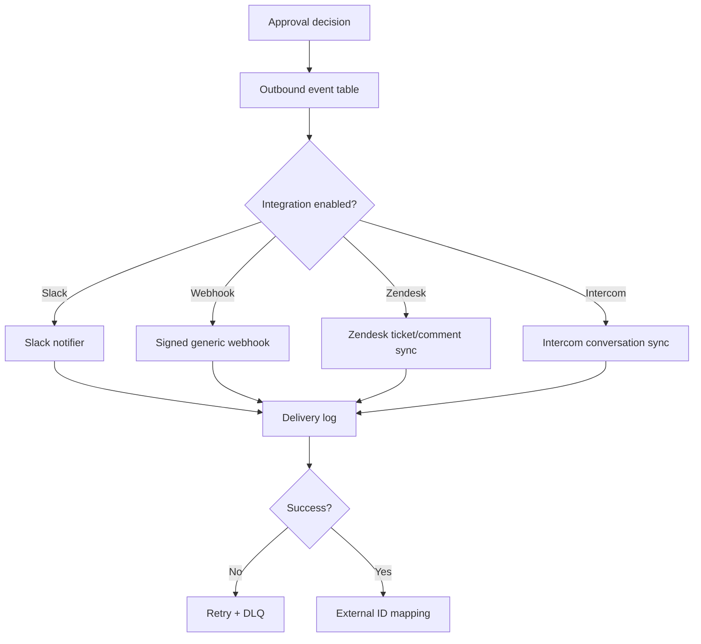
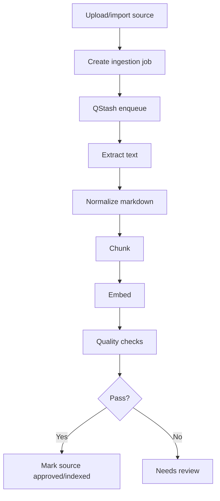

# 22 — SupportPilot Integrations, Infrastructure Hardening, and Local Runtime Plan

## Goal

Complete the P2 production-hardening items that convert SupportPilot from a strong self-contained SaaS into a reliable production platform: external helpdesk/CRM sync, clean Supabase migration/RLS proof, production embeddings, background ingestion, persistent rate limiting, custom domain verification, retention/audit exports, and optional local model runtime.

## Part A — External integrations plan

### Integration priority

| Priority | Integration | Why first | Build now vs defer |
|---:|---|---|---|
| 1 | Slack escalation/approval notifications | Lowest complexity and high workflow value; incoming webhooks can post messages into Slack channels using a unique webhook URL and JSON payload ([Slack Incoming Webhooks](https://docs.slack.dev/messaging/sending-messages-using-incoming-webhooks)). | Build first. |
| 2 | Generic outbound webhook | Gives agencies/dev teams an escape hatch before native CRM/helpdesk support. | Build first. |
| 3 | Zendesk approved-reply/ticket writeback | Zendesk tickets are the agent-side record for customer requests, and the Tickets API supports ticket records and updates ([Zendesk Tickets API](https://developer.zendesk.com/api-reference/ticketing/tickets/tickets/)). | Build after Slack/webhook. |
| 4 | Intercom conversation sync | Intercom’s Conversations API supports creating, retrieving, tagging, and replying to conversations, but OAuth and conversation mapping add complexity ([Intercom Conversations API](https://developers.intercom.com/docs/references/rest-api/api.intercom.io/conversations)). | Defer until Zendesk pattern is stable. |
| 5 | CRM sync | Needs customer-specific field mapping and data governance. | Defer to enterprise contracts. |

### Integration architecture

### Core tables

| Table | Purpose |
|---|---|
| `integration_accounts` | Workspace integration config, encrypted tokens, scopes, status. |
| `integration_external_mappings` | Maps SupportPilot tickets/messages/approvals to external IDs. |
| `outbound_events` | Durable queue of events to send externally. |
| `integration_deliveries` | Attempt logs, response codes, external IDs, retry state. |
| `webhook_endpoints` | Generic customer webhook config and signing secrets. |

### Auth and secrets

| Integration | Auth plan |
|---|---|
| Slack | Start with incoming webhook URL; move to OAuth install with `incoming-webhook` scope for distributed apps. Slack’s OAuth flow grants access tokens based on requested scopes ([Slack OAuth docs](https://docs.slack.dev/authentication/installing-with-oauth/)). |
| Zendesk | Use OAuth for multi-customer integration; Zendesk notes OAuth tokens are scoped and revocable, which is preferable for third-party API access ([Zendesk OAuth docs](https://developer.zendesk.com/documentation/api-basics/authentication/creating-and-using-oauth-tokens-with-the-api/)). |
| Intercom | Use OAuth for public apps accessing other people’s Intercom data; Intercom warns not to ask users for access tokens for public integrations ([Intercom authentication docs](https://developers.intercom.com/docs/build-an-integration/learn-more/authentication)). |
| Generic webhook | Customer supplies URL; SupportPilot signs payload with HMAC secret and supports rotation. |

### Outbound-on-approval behavior

When a manager approves or edits an AI draft:

1. Create `approval_decision`.
2. Create `outbound_event` with idempotency key: `workspace_id + ticket_id + approval_decision_id + integration_id`.
3. Worker sends to enabled integration.
4. Store external ID and response.
5. If delivery fails, retry with exponential backoff.
6. If max retries fail, put event in DLQ and show integration health alert.

### Acceptance criteria — integrations

- [ ] Slack notification sends approval-needed and approved-reply events.
- [ ] Generic webhook delivers signed events and retries failures.
- [ ] Zendesk integration can create ticket and add approved public/internal comment.
- [ ] Duplicate approval deliveries are prevented by idempotency keys.
- [ ] Delivery failures appear in integration health UI.
- [ ] Tokens/webhook secrets are encrypted at rest and never exposed to client bundles.
- [ ] Disabling an integration stops future outbound events but preserves audit history.

## Part B — Live Supabase migration and RLS verification

Supabase’s RLS docs state that once RLS is enabled, no data is accessible through the API using a publishable key until policies are created, making clean-project verification a mandatory production gate ([Supabase RLS docs](https://supabase.com/docs/guides/database/postgres/row-level-security)).

### Clean-project procedure

1. Create a new Supabase project for staging.
2. Apply migrations from zero.
3. Confirm RLS is enabled on every exposed tenant table.
4. Load synthetic seed data only.
5. Create users for owner/admin/manager/agent/customer across two orgs.
6. Run RLS test suite from CI and local script.
7. Run application smoke tests against staging.
8. Generate an RLS verification report artifact.
9. Repeat for production project with no demo seed data.

### RLS verification matrix

| Test | Expected result |
|---|---|
| Anonymous reads tenant table | Denied. |
| Customer reads own ticket | Allowed. |
| Customer reads another customer ticket | Denied. |
| Agent reads own workspace tickets | Allowed. |
| Agent reads other workspace tickets | Denied. |
| Agent approves high-risk draft | Denied. |
| Manager approves workspace draft | Allowed. |
| Admin changes billing | Denied unless owner. |
| Owner exports audit | Allowed. |
| Disabled membership accesses admin | Denied. |

### Acceptance criteria — Supabase/RLS

- [ ] Migrations apply from an empty database.
- [ ] All tenant tables have non-null `org_id` and/or `workspace_id` where applicable.
- [ ] All exposed tables have RLS enabled.
- [ ] Role matrix tests pass in CI.
- [ ] Service-role access exists only in server-side admin services.
- [ ] RLS performance indexes exist for membership and tenant policy columns.

## Part C — Production embeddings and re-embedding migration

The small-model strategy recommends using provider-grade embeddings first and migrating to local/open embeddings when practical ([11 small models](./11_Small_Models_and_Cost_Strategy.md)). Qwen3 Embedding models are designed for text embedding and reranking, include 0.6B/4B/8B sizes, and were released under Apache 2.0 according to Qwen’s release post ([Qwen3 Embedding](https://qwenlm.github.io/blog/qwen3-embedding/)).

### Recommended sequence

| Stage | Embedding choice | Why |
|---|---|---|
| Launch | Managed production embedding provider already supported by app, or Gemini/OpenAI-compatible provider. | Fastest production reliability; avoids local ops. |
| Pro | Add embedding versioning and re-embedding jobs. | Allows provider/model migrations without losing traceability. |
| Enterprise/cost optimization | Qwen3-Embedding-0.6B or bge-small local, benchmarked per corpus. | Lower marginal cost and better data-control story. |
| Advanced quality | Qwen3-Reranker-0.6B or bge-reranker. | Improves retrieval ranking before generation. |

### Data model additions

| Column | Purpose |
|---|---|
| `embedding_model` | Exact model/provider used. |
| `embedding_version` | Migration-safe semantic version. |
| `embedding_dimensions` | Vector dimension. |
| `content_hash` | Avoid duplicate embedding. |
| `source_version_id` | Tie vector to source version. |
| `embedded_at` | Freshness and audit. |

### Migration plan

1. Add versioned embedding columns without deleting old vectors.
2. Keep dual-read support: prefer new version, fallback to old while migration runs.
3. Queue re-embedding jobs per source/workspace.
4. Track progress and failures in ingestion UI.
5. Run golden-question eval before and after migration.
6. Promote new version if quality/latency passes thresholds.
7. Delete old vectors only after retention window.

### Acceptance criteria — embeddings

- [ ] Every vector stores provider/model/version/dimension/source version.
- [ ] Re-embedding can run per source and per workspace.
- [ ] Golden-question results compare old vs new embedding route.
- [ ] Rollback to prior embedding version is possible.
- [ ] Deterministic demo embeddings are disabled in production mode.

## Part D — Background ingestion jobs

Upstash QStash Free includes 1,000 messages/day and Pay-as-you-go is $1 per 100,000 messages, making it a good first queue for ingestion and scheduled jobs in the zero/low-cost stack ([Upstash QStash pricing](https://upstash.com/pricing/qstash)).

### Ingestion job pipeline

### Job types

| Job | Trigger | Output |
|---|---|---|
| `extract_pdf` | PDF upload | Text + extraction preview. |
| `ingest_markdown` | md/txt/paste | Normalized source version. |
| `import_url` | URL import | Cleaned page text. |
| `crawl_site_limited` | Site import | URL queue and page sources. |
| `embed_chunks` | Source version ready | Vector rows. |
| `reembed_source` | Model migration | New embedding version. |
| `run_golden_eval` | Go-live / source change | Quality report. |

### Acceptance criteria — ingestion

- [ ] Large PDFs do not block request/response lifecycle.
- [ ] Every job has status, attempts, error, and retry metadata.
- [ ] User sees progress and failed extraction reasons.
- [ ] Duplicate upload/import uses content hash to avoid duplicate vectors.
- [ ] Failed jobs can be retried manually.

## Part E — Persistent rate limiting

Upstash Redis Free includes 256 MB, 10 GB monthly bandwidth, and 500,000 monthly commands, while pay-as-you-go is $0.20 per 100,000 commands, which is enough for early workspace rate limits without running Redis infrastructure ([Upstash Redis pricing](https://upstash.com/pricing/redis)).

### Limiter scopes

| Scope | Example limit | Reason |
|---|---|---|
| Workspace monthly quota | Plan entitlement | Billing/usage control. |
| Workspace per-minute AI calls | Burst protection | Protect model providers. |
| Domain/IP/session widget | Abuse prevention | Public widget is exposed. |
| Customer portal account | Credential stuffing control | Auth/login safety. |
| Ingestion jobs | Queue pressure | Avoid one tenant starving others. |

### Acceptance criteria — rate limiting

- [ ] In-memory counters are not used in production.
- [ ] Limits survive server restarts and scale across serverless instances.
- [ ] Rate-limit events create security events.
- [ ] Users see plan-aware upgrade or retry messages.
- [ ] Admin analytics show rate-limit hits by workspace/domain.

## Part F — Custom domain verification automation

### Flow

1. Owner/admin enters domain.
2. App creates verification record with random TXT token.
3. User adds DNS TXT or CNAME.
4. Background job checks DNS.
5. Domain becomes `verified`.
6. Origin allowlist and widget config become active.
7. Custom portal/widget host routing is enabled when supported.

### Acceptance criteria — domain verification

- [ ] Domain cannot be used for widget production traffic until verified.
- [ ] DNS token is unique and auditable.
- [ ] Verification status is visible in settings.
- [ ] Removing DNS can optionally mark domain stale after grace period.
- [ ] Verified domain changes create audit events.

## Part G — Retention deletion jobs and immutable audit/evidence exports

GDPR Article 17 gives data subjects a right to erasure under defined circumstances, so SupportPilot needs operational deletion workflows rather than only settings copy ([GDPR Article 17](https://gdpr-info.eu/art-17-gdpr/)). The EU AI Act adds transparency obligations for AI systems interacting directly with people, including informing humans that they are interacting with AI ([European Commission AI Act](https://digital-strategy.ec.europa.eu/en/policies/regulatory-framework-ai)).

### Retention model

| Data category | Default | Enterprise option |
|---|---:|---|
| Conversations/messages | 180 days | 30/90/180/365/custom. |
| Tickets | 365 days | Custom retention + legal hold. |
| AI runs/model logs | 365 days with redaction | Custom retention, prompt hashes only. |
| Audit/security events | 365+ days | Longer retention, immutable export. |
| Source documents | Until deleted | Source-level deletion and reindex. |
| Integration tokens | Until revoked | Immediate revoke/delete. |

### Deletion workflow

1. Admin/customer requests deletion.
2. Verify identity and authority.
3. Create `deletion_request` with scope.
4. Optional export before delete.
5. Queue deletion job.
6. Delete or anonymize dependent records according to policy.
7. Reindex vectors if source/user data affected.
8. Write non-PII audit proof of deletion.

### Immutable evidence exports

- Export audit logs, security events, access reviews, RLS test reports, deployment records, incident records, vendor list, and backup/restore tests.
- Hash each export file and store hash in Postgres.
- Store exports in private object storage with versioning/retention lock if available.
- Generate monthly evidence packet for SOC 2 readiness.

AICPA describes SOC 2 as an examination/report over controls at a service organization relevant to security, availability, processing integrity, confidentiality, or privacy, so SupportPilot should say “SOC 2 readiness” until an actual independent report exists ([AICPA SOC 2](https://www.aicpa-cima.com/topic/audit-assurance/audit-and-assurance-greater-than-soc-2)).

### Acceptance criteria — retention/audit

- [ ] Workspace retention settings drive scheduled deletion jobs.
- [ ] Deletion request has status, scope, actor, timestamps, and audit proof.
- [ ] Exports include full URLs/IDs needed for evidence review.
- [ ] Audit export files are hashed and tamper-evident.
- [ ] Marketing copy does not claim SOC 2 certification unless an audit report exists.

## Part H — Local/self-hosted model runtime plan (P2)

This is P2 because production SaaS can launch with managed providers plus cost controls. Local runtime becomes valuable for margin, sensitive tenants, offline demos, and enterprise data-control requirements.

### Runtime choices

| Runtime | Use | Recommendation |
|---|---|---|
| Ollama | Local/dev experiments and simple self-hosted demos. | Use first for developer activation because Ollama is designed to run open models locally quickly ([Ollama](https://ollama.com)). |
| llama.cpp | CPU/GGUF inference path. | Use for tiny local classifiers or edge/dev experiments. |
| vLLM | Production GPU serving. | Use for production local generation because vLLM provides a production stack with Kubernetes/Helm/Grafana, multimodel support, and model-aware routing ([vLLM production stack](https://docs.vllm.ai/en/latest/deployment/integrations/production-stack/)). |
| Hugging Face TGI | Existing HF-standard environments. | Defer for new builds because the existing small-model research notes TGI is in maintenance mode ([11 small models](./11_Small_Models_and_Cost_Strategy.md)). |

### Plug into R0–R5 router

| Route | Local activation | Fallback |
|---|---|---|
| R0 classification/redaction | Qwen3-0.6B/Phi-mini/SmolLM via Ollama or vLLM. | Deterministic rules. |
| R1 query rewrite | Qwen3-0.6B/1.7B. | Gemini Flash/Flash-Lite. |
| R2 easy grounded answer | Qwen3-4B/Gemma/Phi-4-mini if evals pass. | Gemini/Groq/OpenRouter. |
| R3 reranking | Qwen3-Reranker-0.6B. | Lexical/source score boost. |
| R4 ambiguous/high-risk | Managed strong model. | Approval queue. |
| R5 critical/legal/security | Premium model + approval. | Human escalation. |

### Activation steps

1. Add provider adapter `local_openai_compatible`.
2. Add env vars for local base URL, API key, model IDs, timeout, max concurrency.
3. Run local embeddings experiment on one test workspace.
4. Add eval dashboard comparing local vs managed output.
5. Add failover: local timeout/grounding fail → managed route.
6. Add tenant-level route policy: `managed_only`, `local_preferred`, `local_only_for_sensitive`.
7. Add runtime health checks and per-route latency/cost dashboards.
8. Only enable R2 local answers when golden questions pass quality threshold.

### Acceptance criteria — local runtime

- [ ] Local model endpoint can be called through the same model router interface.
- [ ] Local embedding/reranker calls store provider/model/version metadata.
- [ ] Router logs local route latency, tokens, confidence, fallback reason.
- [ ] Managed fallback fires on timeout, low confidence, or grounding failure.
- [ ] Tenant can be configured to prefer/disable local routes.

## Sequenced hardening order

1. Clean Supabase migration/RLS verification.
2. Persistent rate limiting.
3. Production embeddings and re-embedding versioning.
4. Background ingestion jobs.
5. Slack + generic webhook.
6. Zendesk writeback.
7. Domain verification automation.
8. Retention jobs and audit exports.
9. Supabase SAML, then WorkOS/SCIM as needed.
10. Local runtime activation.
