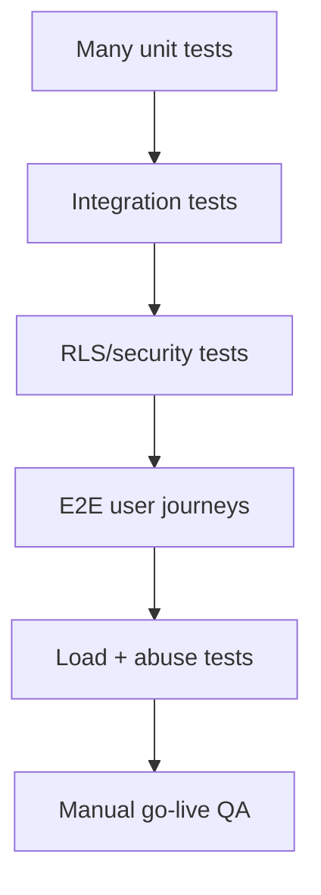
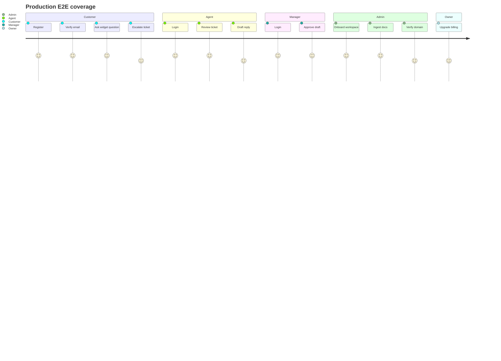

# 23 — SupportPilot Testing and QA Strategy

## Goal

Define the production test system that lets SupportPilot move from “feature-complete demo” to “safe real SaaS.” Testing must prove tenant isolation, auth, billing, widget safety, RAG grounding, approvals, integrations, and usage enforcement.

## Tooling recommendation

| Layer | Tool | Why |
|---|---|---|
| Unit/component | Vitest | Vitest is a Vite-powered test framework that reads Vite config by default and supports `vitest run` for one-shot CI runs ([Vitest guide](https://vitest.dev/guide/)). |
| E2E | Playwright | Playwright documents GitHub Actions workflows that install browsers, run `npx playwright test`, and upload HTML reports as artifacts ([Playwright CI docs](https://playwright.dev/docs/ci-intro)). |
| CI | GitHub Actions | GitHub Free includes 2,000 Actions minutes/month and public repositories run Actions for free ([GitHub pricing](https://github.com/pricing)). |
| DB/RLS | Supabase local + staging clean project | RLS must be proven at database level, not just API level. |
| Webhook tests | Stripe CLI + signed fixture payloads | Stripe requires signature verification from raw request body and endpoint secret for secure webhook handling ([Stripe webhook signature docs](https://docs.stripe.com/webhooks/signature)). |
| AI evals | Golden-question fixtures + deterministic grading rubric | Measures grounded answers, citation coverage, refusal, and escalation behavior. |
| Security | OWASP GenAI/LLM test cases | OWASP GenAI Top 10 covers prompt injection, sensitive information disclosure, insecure output handling, and excessive agency risks ([OWASP GenAI Top 10](https://genai.owasp.org/llm-top-10/)). |

## Test pyramid

| Test level | Ratio | Purpose | Runtime target |
|---|---:|---|---:|
| Unit | 55% | Fast logic confidence. | <2 min |
| Integration | 25% | Auth, DB, APIs, webhooks, queues. | <8 min |
| RLS/security | 10% | Tenant isolation and permission proof. | <5 min |
| E2E | 8% | Critical user journeys. | <15 min |
| Load/evals/manual | 2% | Release gates and launch confidence. | Scheduled/release |

## Unit test plan

| Module | Tests |
|---|---|
| RAG scoring | similarity thresholds, source freshness boost, approved-source filter, no-source escalation. |
| Citation formatting | source title, chunk quote, URL/file reference, missing citation behavior. |
| Risk/policy logic | low confidence, angry sentiment, refund, billing, legal, SSO/security, sensitive data. |
| Model routing | R0–R5 route decisions, fallback reason, cost estimate, timeout behavior. |
| Redaction | email, phone, token, API key, address, payment-like strings, prompt hash. |
| RBAC | role permission matrix, owner-only actions, manager approvals, agent restrictions. |
| Invites | token hash, expiry, email mismatch, role assignment, single-use behavior. |
| Billing | entitlement mapping, quota counters, dunning state transitions. |
| Rate limits | per-workspace, per-IP, per-domain, per-session decisions. |
| Ingestion | chunking, content hash, source versioning, extraction status transitions. |

## Integration test plan

| Flow | What to verify |
|---|---|
| Auth sign-up | Email/password sign-up, email verification callback, profile creation, owner membership. |
| Password reset | Reset request, recovery callback, password update, old password rejection. |
| Magic link | One-time login, redirect URL allowlist, blocked auto-signup where configured. |
| OAuth | Provider callback, profile linking, workspace membership resolution. |
| Invite accept | New user and existing user paths, role assignment, audit event. |
| RLS per role | Customer/agent/manager/admin/owner data boundaries. |
| Approval workflow | Draft created, manager approve/edit/reject/escalate, audit timeline. |
| Billing webhook | Subscription created/updated/deleted, invoice paid/failed, duplicate event replay. |
| Widget origin | Allowed domain works; unverified origin blocked; signed session accepted/rejected. |
| Knowledge ingestion | Upload → extract → chunk → embed → retrieve → answer with citations. |
| Background jobs | QStash enqueue, retry, DLQ, status UI. |
| Integrations | Slack/webhook/Zendesk delivery, retry, idempotency, health state. |

## RLS/security test matrix

Supabase RLS policies are applied automatically to queries once enabled, and unauthenticated requests return `null` for `auth.uid()`, so tests must cover both authenticated and anonymous paths ([Supabase RLS docs](https://supabase.com/docs/guides/database/postgres/row-level-security)).

| Actor | Allowed | Denied |
|---|---|---|
| Anonymous | Public landing, verified widget config only. | Tenant tables, admin APIs, portal account data. |
| Customer A | Own tickets/messages/profile. | Other customers, workspace sources, approvals, billing, other orgs. |
| Agent A | Workspace tickets/messages/drafts. | Other workspace, approvals requiring manager, settings, billing. |
| Manager A | Workspace tickets, approvals, analytics. | Billing/security/owner-only settings, other workspace. |
| Admin A | Workspace settings, sources, policies, members except owner. | Owner transfer/delete, billing plan change if owner-only, other org. |
| Owner A | Org/workspace admin, billing, audit export. | Other org. |
| Disabled user | Nothing except login/no-access page. | All workspace data. |

### Required RLS fixtures

- Org A: workspace A1, tickets A1, sources A1, approvals A1.
- Org B: workspace B1, tickets B1, sources B1.
- Users: owner, admin, manager, agent, customer for A; agent/customer for B.
- Every test attempts positive and negative access.

## E2E Playwright journeys

### Critical E2E tests

1. **Customer register → chat → escalate**
   - Customer signs up on portal.
   - Verifies email.
   - Opens widget/portal chat.
   - Asks a question requiring escalation.
   - Ticket appears in admin inbox.

2. **Agent login → draft → manager approval**
   - Agent logs in.
   - Opens ticket.
   - Generates AI draft with citations.
   - Risk triggers manager queue.
   - Manager approves.
   - Audit timeline updates.

3. **Admin onboarding wizard**
   - Owner signs up.
   - Creates workspace.
   - Uploads docs.
   - Configures brand/voice.
   - Verifies domain.
   - Installs widget snippet on test page.
   - Runs golden questions.
   - Marks workspace live.

4. **Billing upgrade**
   - Free/demo owner hits usage wall.
   - Starts Stripe Checkout in test mode.
   - Webhook activates Launch/Pro entitlement.
   - Owner sees increased limit.

5. **Widget origin enforcement**
   - Verified domain loads widget and creates session.
   - Unverified domain fails config/session call.
   - Signed widget session accepts valid token and rejects tampered token.

## RAG and AI evals

### Golden-question dataset

Each tenant should have 20–50 golden questions before go-live.

| Field | Description |
|---|---|
| `question` | User-facing support question. |
| `expected_answer_points` | Key facts that must appear. |
| `expected_sources` | Source IDs/chunks that should support answer. |
| `risk_category` | low, refund, billing, legal, security, privacy, deletion, SSO. |
| `expected_action` | answer, ask clarifying, approval, escalate, refuse. |
| `must_not_say` | Unsupported claims or banned policy promises. |

### Eval checks

| Check | Pass condition |
|---|---|
| Grounding | Every factual answer cites approved source chunks. |
| Citation relevance | Top citations actually support answer claims. |
| Refusal/escalation | No-source or restricted topics do not hallucinate. |
| Risk routing | Refund/billing/legal/security/privacy/deletion route to approval/escalation. |
| Tone | Response follows tenant brand/voice and avoids overpromising. |
| Cost/latency | Route meets budget and P95 latency target. |
| Regression | New prompt/model/source does not reduce pass rate below threshold. |

## Load and rate-limit tests

| Scenario | Target |
|---|---|
| 100 concurrent widget sessions on one workspace | No cross-session leakage; P95 within budget; no provider quota blow-up. |
| Burst from one IP/domain | Rate limiter triggers and creates security events. |
| Large PDF ingestion | Request returns quickly; background job processes with progress. |
| Stripe webhook replay | Duplicate events ignored. |
| Integration outage | Retries and DLQ work; no duplicate external replies. |
| Dashboard analytics | Precomputed metrics avoid slow scans. |

## CI gates

| Gate | Runs on PR | Runs on main | Blocks deploy |
|---|---:|---:|---:|
| Typecheck/lint | Yes | Yes | Yes |
| Unit tests | Yes | Yes | Yes |
| RLS test suite | Yes with local/staging DB | Yes | Yes |
| Migration dry run | Yes | Yes | Yes |
| Integration smoke | Selected | Full | Yes for release |
| Playwright E2E | Critical subset | Full | Yes for release |
| Golden eval smoke | Yes | Full | Yes for model/prompt/source changes |
| Security checks | Yes | Yes | Yes |
| Load tests | No | Scheduled/release | Manual gate |

Playwright’s CI docs show how to upload an HTML test report artifact in GitHub Actions, which should be required for failed E2E runs ([Playwright CI docs](https://playwright.dev/docs/ci-intro)).

## Feature-mapped checklist

| Feature | Unit | Integration | E2E | Security/RLS | Eval/load |
|---|---:|---:|---:|---:|---:|
| Supabase Auth | ✓ | ✓ | ✓ | ✓ |  |
| Workspace invites | ✓ | ✓ | ✓ | ✓ |  |
| RBAC | ✓ | ✓ | ✓ | ✓ |  |
| Customer portal | ✓ | ✓ | ✓ | ✓ |  |
| Widget/embed | ✓ | ✓ | ✓ | ✓ | load |
| RAG answers | ✓ | ✓ | ✓ |  | eval |
| AI drafts | ✓ | ✓ | ✓ |  | eval |
| Approval queue | ✓ | ✓ | ✓ | ✓ |  |
| Billing/Stripe | ✓ | ✓ | ✓ |  | replay |
| Usage limits | ✓ | ✓ | ✓ |  | load |
| Ingestion jobs | ✓ | ✓ | partial |  | load |
| Slack/Zendesk/webhooks | ✓ | ✓ | partial | secret checks | retry/load |
| Retention/delete | ✓ | ✓ | partial | ✓ |  |
| Audit exports | ✓ | ✓ | partial | ✓ |  |
| SSO/SAML | ✓ | ✓ | ✓ | ✓ |  |

## Release QA checklist

### Before every production release

- [ ] All CI gates pass.
- [ ] Migrations applied to staging from clean database.
- [ ] RLS suite passes against staging.
- [ ] Critical Playwright journeys pass.
- [ ] Golden questions pass for demo and active pilot workspaces.
- [ ] Stripe webhook replay test passes.
- [ ] Widget origin test passes.
- [ ] Sentry/PostHog release tags configured if enabled.
- [ ] Rollback plan documented for widget and app.

### Before first paid launch

- [ ] Clean Supabase production project provisioned.
- [ ] No seeded demo workspace is required for real onboarding.
- [ ] Owner/admin/manager/agent/customer roles tested.
- [ ] Stripe live-mode endpoint configured.
- [ ] Production rate limiter enabled.
- [ ] Production embeddings enabled.
- [ ] Data retention defaults documented.
- [ ] Security copy says readiness, not certification.

## Done means

Testing is production-complete when any code change that can break auth, RLS, billing, widget security, RAG grounding, or approvals is caught by automated tests before deploy, and every release produces auditable artifacts: CI results, RLS report, E2E report, migration record, and golden-question eval summary.
