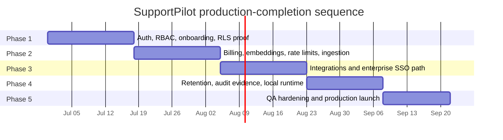

# 24 — SupportPilot Production Execution Roadmap

## Roadmap objective

This is the definitive “what to do next” sequence for taking SupportPilot from feature-complete portfolio/demo to production-complete SaaS. The roadmap front-loads the user’s stated priority: full authentication, multi-role identity, onboarding, invites, and live Supabase RLS verification.

## Guiding principles

1. **Do not add more visible polish before identity is real.** The design is locked and the P0/P1 UI/product plans are implemented.
2. **Make Supabase Auth + RLS the tenant security backbone.** Supabase Auth integrates with Postgres RLS and Supabase requires RLS on exposed schemas for secure data access ([Supabase Auth](https://supabase.com/auth), [Supabase RLS docs](https://supabase.com/docs/guides/database/postgres/row-level-security)).
3. **Treat Stripe webhooks as the billing source of truth.** Stripe recommends webhooks for subscription status changes and payment failures because subscription activity is asynchronous ([Stripe subscription webhooks](https://docs.stripe.com/billing/subscriptions/webhooks)).
4. **Say “SOC 2 readiness,” not “SOC 2 certified,” until an independent SOC 2 examination/report exists.** AICPA describes SOC 2 as a report on controls relevant to security, availability, processing integrity, confidentiality, or privacy ([AICPA SOC 2](https://www.aicpa-cima.com/topic/audit-assurance/audit-and-assurance-greater-than-soc-2)).

## Roadmap overview

> Effort estimates assume one focused builder using Codex/ChatGPT for implementation and the existing codebase already containing the implemented P0/P1 features described by the user.

## Phase 1 — Authentication, multi-role, onboarding, and RLS proof

**Target effort:** 2.5–4 weeks  
**Priority:** P0  
**Blocks:** every real customer

### Scope

- Supabase Auth email/password.
- Email verification.
- Password reset.
- Magic link login.
- Optional Google/GitHub OAuth.
- Owner/admin/manager/agent/customer roles.
- Orgs, workspaces, memberships, invitations, portal identities.
- Next.js route protection and server-side session handling.
- Workspace creation and invite accept flows.
- Live-in-24h onboarding wizard.
- Clean Supabase migration and RLS verification.

### Dependencies

- Existing Supabase migrations and admin service layer.
- Existing settings/onboarding/checklist UI.
- Existing ticket, knowledge, approval, analytics, widget routes.

### Build order

1. Add `profiles`, `orgs`, `workspaces`, `memberships`, `invitations`, `portal_identities` migrations.
2. Add RLS helper functions and initial policies.
3. Add Supabase SSR clients and middleware/proxy route protection.
4. Build auth pages: sign-up, login, forgot/reset password, magic link, OAuth callback, logout.
5. Build first-user create-org/workspace flow.
6. Build member invite and accept-invite flow.
7. Build customer portal register/login flow.
8. Build onboarding wizard: workspace → docs → brand/voice → domain → embed → golden questions → go live.
9. Run clean Supabase migration and RLS test matrix.
10. Patch all route/API assumptions that still depend on seeded demo workspace.

### Exit criteria

- [ ] New owner can sign up, verify email, create org/workspace, and reach onboarding.
- [ ] Owner can invite admin/manager/agent; invitee can accept and reach role-specific UI.
- [ ] Customer can register/login to portal and access only own tickets.
- [ ] All admin routes are role-protected.
- [ ] RLS tests pass across customer/agent/manager/admin/owner and a second workspace.
- [ ] Clean Supabase project can run migrations and onboard without seed data.
- [ ] Workspace can reach `live` health state through wizard.

### Main risks and mitigations

| Risk | Mitigation |
|---|---|
| RLS policies become complex and slow. | Use helper functions, indexes, and focused RLS tests; Supabase recommends indexes on policy columns and careful RLS performance patterns ([Supabase RLS performance guidance](https://supabase.com/docs/guides/troubleshooting/rls-performance-and-best-practices-Z5Jjwv)). |
| Users can authenticate but have no workspace. | Add deterministic post-login router: create workspace, accept invite, choose workspace, or no-access. |
| Customer and internal roles overlap incorrectly. | Store customer portal identity separately from internal workspace membership. |

## Phase 2 — Billing, production embeddings, persistent limits, and background ingestion

**Target effort:** 2.5–4 weeks  
**Priority:** P1  
**Blocks:** paid SaaS launch

### Scope

- Stripe Launch/Pro products and prices.
- Checkout and customer portal.
- Webhooks for subscription and invoice lifecycle.
- Internal subscription/entitlement sync.
- Usage limits integrated with existing billing page.
- Provider-grade embeddings and embedding versioning.
- Background ingestion jobs for PDFs/site imports.
- Upstash Redis persistent rate limiting.
- Upstash QStash queue/cron jobs.

Stripe Billing supports subscriptions and webhooks, and Stripe webhook endpoints should verify signatures with the raw request body and endpoint secret ([Stripe Billing docs](https://docs.stripe.com/billing), [Stripe webhook signature docs](https://docs.stripe.com/webhooks/signature)). Upstash Redis has a free tier suitable for early rate limiting and pay-as-you-go pricing at $0.20 per 100,000 commands, while QStash Free includes 1,000 messages/day and pay-as-you-go at $1 per 100,000 messages ([Upstash Redis pricing](https://upstash.com/pricing/redis), [Upstash QStash pricing](https://upstash.com/pricing/qstash)).

### Build order

1. Create Stripe products/prices in test mode.
2. Add billing tables: customers, subscriptions, invoices, webhook events, entitlements.
3. Implement checkout and portal routes.
4. Implement webhook handler and idempotent event processing.
5. Wire entitlements into chat, AI draft, ingestion, seats, workspaces, integrations.
6. Add persistent rate limiter.
7. Replace deterministic/demo embeddings with production provider route.
8. Add embedding version columns and re-embedding jobs.
9. Add QStash ingestion jobs for large files/imports.
10. Run test-mode billing and ingestion E2E.

### Exit criteria

- [ ] Owner can upgrade through Stripe Checkout.
- [ ] Webhooks update entitlements, invoices, and dunning state.
- [ ] Usage limits are enforced from `entitlements`, not UI-only values.
- [ ] Public widget has persistent workspace/domain/IP/session limits.
- [ ] Production embeddings are stored with model/version metadata.
- [ ] Large PDF ingestion runs async with progress and retry.
- [ ] Stripe live-mode checklist is ready but not enabled until final launch.

### Main risks and mitigations

| Risk | Mitigation |
|---|---|
| Stripe/internal subscription mismatch. | Store webhook events, process idempotently, run nightly reconciliation. |
| Rate-limit cost grows. | Start with coarse workspace/session limits; monitor Upstash commands; use local deny cache for repeated blocked calls. |
| Embedding migration hurts quality. | Dual-read old/new vectors and promote only after golden-question pass. |

## Phase 3 — External integrations and enterprise identity path

**Target effort:** 2.5–4 weeks  
**Priority:** P2  
**Blocks:** enterprise/helpdesk deals

### Scope

- Slack notifications and approval deep links.
- Generic signed outbound webhooks.
- Zendesk approved-reply/ticket writeback.
- Intercom planning/optional initial connector.
- Supabase SAML for first enterprise SSO tenants.
- WorkOS/SCIM design and optional pilot integration.

Slack incoming webhooks can post JSON payloads to a selected Slack channel, making Slack the fastest first integration ([Slack Incoming Webhooks](https://docs.slack.dev/messaging/sending-messages-using-incoming-webhooks)). Zendesk OAuth tokens are scoped and revocable, making OAuth preferable for distributed integrations ([Zendesk OAuth docs](https://developer.zendesk.com/documentation/api-basics/authentication/creating-and-using-oauth-tokens-with-the-api/)). Supabase SAML supports SAML 2.0-compatible identity providers on Pro and above, including common providers such as Okta, Google Workspace, Microsoft Entra/Azure AD, PingIdentity, and OneLogin ([Supabase SAML docs](https://supabase.com/docs/guides/auth/enterprise-sso/auth-sso-saml)).

### Build order

1. Add integration account tables and encrypted secret storage.
2. Build outbound event/delivery log system.
3. Build Slack webhook integration.
4. Build generic signed webhook integration.
5. Build Zendesk OAuth/API-token pilot and approved comment/ticket writeback.
6. Add integration health UI and retry/DLQ.
7. Add Supabase SAML tenant configuration path.
8. Design WorkOS SCIM/Directory Sync mapping for future enterprise tenants.

### Exit criteria

- [ ] Slack sends escalation and approval notifications.
- [ ] Generic webhooks are signed and retried.
- [ ] Zendesk can create/update ticket/comment from an approved reply.
- [ ] Duplicate outbound replies are prevented.
- [ ] Integration failures surface in admin settings.
- [ ] One staging tenant can use SAML SSO.
- [ ] SSO login creates or maps membership without bypassing role policy.

### Main risks and mitigations

| Risk | Mitigation |
|---|---|
| Duplicate external replies. | Idempotency keys and external ID mapping. |
| OAuth token exposure. | Encrypt tokens, never expose to client, audit every integration action. |
| SSO user lands without role. | Require domain/provider mapping and safe default role or admin approval. |

## Phase 4 — Retention, audit evidence, SOC 2 readiness automation, and local runtime

**Target effort:** 2–3.5 weeks  
**Priority:** P2  
**Blocks:** security procurement and cost/data-control enterprise cases

### Scope

- Retention deletion jobs.
- GDPR deletion/export workflow.
- Immutable audit/evidence exports.
- SOC 2 evidence packet automation.
- EU AI Act transparency items.
- Local model runtime via Ollama/dev and vLLM/production experiment.
- Local embeddings/reranker activation for selected tenants.

GDPR Article 17 describes the right to erasure under defined circumstances, which means SupportPilot needs real deletion workflows for personal data rather than just policy copy ([GDPR Article 17](https://gdpr-info.eu/art-17-gdpr/)). The European Commission states that AI systems such as chatbots should make humans aware they are interacting with a machine, and transparency rules come into effect in August 2026 ([European Commission AI Act](https://digital-strategy.ec.europa.eu/en/policies/regulatory-framework-ai)).

### Build order

1. Add retention policy scheduler.
2. Add deletion request table and deletion jobs.
3. Add user/conversation/source export jobs.
4. Add audit export hashing and evidence packet generator.
5. Add access review and vendor/subprocessor evidence templates.
6. Add AI disclosure checks in widget/portal.
7. Add local OpenAI-compatible model adapter.
8. Add Ollama dev route and vLLM production experiment route.
9. Add local embedding/reranker eval path.
10. Add tenant-level model policy.

### Exit criteria

- [ ] Retention settings drive real deletion jobs.
- [ ] Data export and deletion workflows are auditable.
- [ ] Audit exports are hashed and tamper-evident.
- [ ] Monthly SOC 2 readiness packet can be generated.
- [ ] Product copy uses “readiness” unless audited.
- [ ] Widget/portal clearly disclose AI assistance.
- [ ] Local runtime can handle R0/R1/R3 in staging and fall back safely.

### Main risks and mitigations

| Risk | Mitigation |
|---|---|
| Deletion breaks audit traceability. | Keep minimal non-PII audit proof with request ID, actor, timestamp, scope, hash. |
| SOC 2 claim overreach. | Lock marketing/security copy until independent audit exists. |
| Local model quality is inconsistent. | Keep P2, eval-gated, and fallback-managed. |

## Phase 5 — Full QA hardening and production launch

**Target effort:** 2–3 weeks  
**Priority:** P0/P1 final gate  
**Blocks:** public launch

### Scope

- Full test pyramid implementation.
- CI gates.
- RLS report artifacts.
- Playwright E2E journeys.
- Golden-question eval dashboards.
- Load/rate-limit tests.
- Production go-live runbook.
- Rollback plans.

Playwright supports GitHub Actions CI workflows that install dependencies, install browsers, run Playwright tests, and upload reports as artifacts ([Playwright CI docs](https://playwright.dev/docs/ci-intro)). Vitest is appropriate for fast unit/component tests because it is Vite-native and can run once in CI via `vitest run` ([Vitest guide](https://vitest.dev/guide/)).

### Build order

1. Add Vitest unit coverage for policy/RAG/router/redaction/RBAC/billing.
2. Add integration tests for auth, RLS, billing, widget, approvals, ingestion, integrations.
3. Add Playwright critical journeys.
4. Add golden-question eval runner.
5. Add GitHub Actions gates.
6. Run staging launch rehearsal.
7. Freeze production config.
8. Run live-mode Stripe/Supabase/Upstash/embedding smoke tests.
9. Launch with one controlled tenant.
10. Monitor, patch, then open broader self-serve access.

### Exit criteria

- [ ] CI blocks deploy on type/lint/unit/RLS/migration failures.
- [ ] E2E reports are uploaded for every release candidate.
- [ ] Golden evals pass for demo and launch tenant.
- [ ] Load/rate-limit tests pass within budget.
- [ ] Go-live runbook has been rehearsed in staging.
- [ ] Rollback plan has named owner and steps.

## Definition of production-done

SupportPilot is production-done when all items below are true:

### Identity and tenancy

- [ ] Supabase Auth supports email/password, magic link, password reset, email verification, and selected OAuth.
- [ ] Owner/admin/manager/agent/customer roles are enforced in UI, API, and RLS.
- [ ] Sign-up creates org/workspace without seed data.
- [ ] Invites and accept-invite work for every internal role.
- [ ] Customer portal registration/login works.
- [ ] Clean Supabase migration/RLS verification passes.

### Product activation

- [ ] New workspace can go live through wizard.
- [ ] Docs are ingested with production embeddings.
- [ ] Domain is verified and widget install is tested.
- [ ] Golden questions pass before go-live.
- [ ] Empty states guide all first-run actions.

### Billing and usage

- [ ] Stripe Checkout, Customer Portal, subscriptions, invoices, webhooks, and entitlements are live.
- [ ] Usage limits are enforced by plan.
- [ ] Dunning and cancellation states are safe.
- [ ] Nightly Stripe reconciliation exists.

### Reliability and scale

- [ ] Persistent rate limits protect widget/model APIs.
- [ ] Background ingestion handles large docs and retries failures.
- [ ] Sentry/PostHog or equivalent telemetry is configured if enabled.
- [ ] Rollback exists for app and widget JS.

### Security and compliance readiness

- [ ] Retention jobs and deletion/export workflows exist.
- [ ] Audit logs cover auth, admin changes, approvals, AI runs, integrations, billing, security events.
- [ ] Evidence exports are tamper-evident.
- [ ] SSO/SAML path is documented and at least staged.
- [ ] Marketing/security claims are accurate and do not imply SOC 2 certification without a report.
- [ ] AI disclosure is visible in widget/portal.

### QA

- [ ] Unit, integration, RLS, E2E, load, and eval tests are in CI or release gates.
- [ ] Critical customer/admin/owner journeys pass.
- [ ] RAG evals prove grounding and safe escalation.
- [ ] Security tests cover prompt injection, PII logging, origin spoofing, and cross-tenant access.

## Go-live runbook

### T-7 days

- Freeze schema changes except blockers.
- Create production Supabase project.
- Apply migrations from zero.
- Configure Supabase Auth URLs, email templates, OAuth providers, SMTP if needed.
- Configure Stripe live products/prices/webhook endpoint.
- Configure Upstash Redis/QStash.
- Configure model provider keys and production embeddings.
- Configure Sentry/PostHog if enabled.

### T-5 days

- Run RLS verification suite on production-like staging.
- Run Playwright critical journeys.
- Run golden-question evals.
- Run Stripe test-mode matrix.
- Run ingestion job test with large PDF.
- Run widget allowed/blocked origin tests.

### T-3 days

- Rehearse rollback.
- Export evidence packet: migrations, RLS results, CI, security checklist, vendor list, incident contacts.
- Review all landing/security/pricing copy against implemented behavior.
- Confirm support email/escalation path.

### T-1 day

- Switch Stripe endpoint to live mode.
- Confirm production DNS/domain verification.
- Confirm backups/restore point.
- Confirm rate limits and quotas.
- Create first production tenant manually or through self-serve flow.
- Run smoke test from owner → onboarding → widget → ticket → approval → billing.

### Launch day

1. Enable production feature flag for first tenant.
2. Watch auth, RLS errors, Stripe webhook events, rate-limit hits, model errors, ingestion jobs.
3. Keep writeback integrations in monitored mode for first tenant.
4. Review first 25 conversations manually.
5. Patch source gaps and golden-question failures.
6. Expand to next tenants only after 48 hours stable.

### Rollback plan

| Component | Rollback |
|---|---|
| App deploy | Revert to previous Vercel deployment. |
| Widget JS | Serve previous versioned widget loader. |
| Database migration | Prefer forward fix; only rollback if migration is reversible and no data loss. |
| Stripe webhooks | Disable endpoint or pause handler; replay after fix. |
| Model provider | Switch route config to previous provider/model. |
| Integration writeback | Disable outbound integration; leave email fallback active. |

## Key risks and mitigations

| Risk | Probability | Impact | Mitigation |
|---|---:|---:|---|
| Auth/RLS delay | Medium | Critical | Phase 1 is first; no billing/integrations until RLS proof passes. |
| Stripe webhook edge cases | Medium | High | Idempotent handler, event storage, reconciliation, test-mode replay. |
| RAG quality regression | Medium | High | Embedding versioning, golden evals, source freshness, rollback. |
| Public widget abuse | High | High | Upstash rate limits, signed sessions, domain verification, plan quotas. |
| Integration duplicates | Medium | Medium | Outbound events, idempotency keys, external mappings, DLQ. |
| Enterprise identity complexity | Medium | Medium | Start Supabase SAML, add WorkOS only when SCIM/IT-admin need is paid for. |
| Compliance overclaim | Low | High | Lock copy to readiness; generate evidence but do not claim certification. |
| Local model distraction | Medium | Medium | Keep P2; launch with managed providers; eval-gate local routes. |

## Immediate next 10 implementation tickets

1. Create final auth/RBAC schema migration.
2. Implement Supabase SSR client and route middleware/proxy.
3. Build sign-up/login/reset/magic-link pages.
4. Build create-org/workspace first-run transaction.
5. Build invite/accept-invite flow.
6. Build customer portal auth and portal identity model.
7. Implement RLS helper functions and table policies.
8. Create RLS test fixtures and CI script.
9. Convert current onboarding checklist into wizard state machine.
10. Run clean Supabase project rehearsal and fix every seeded-workspace assumption.
